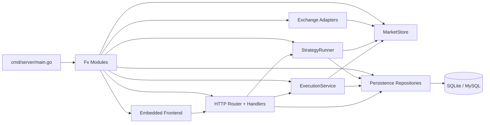
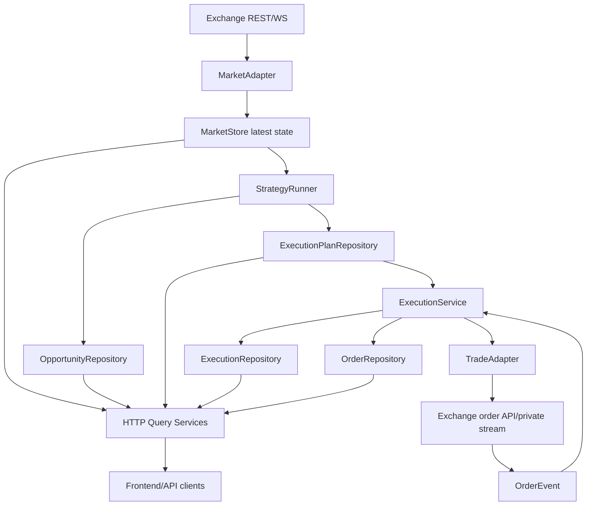
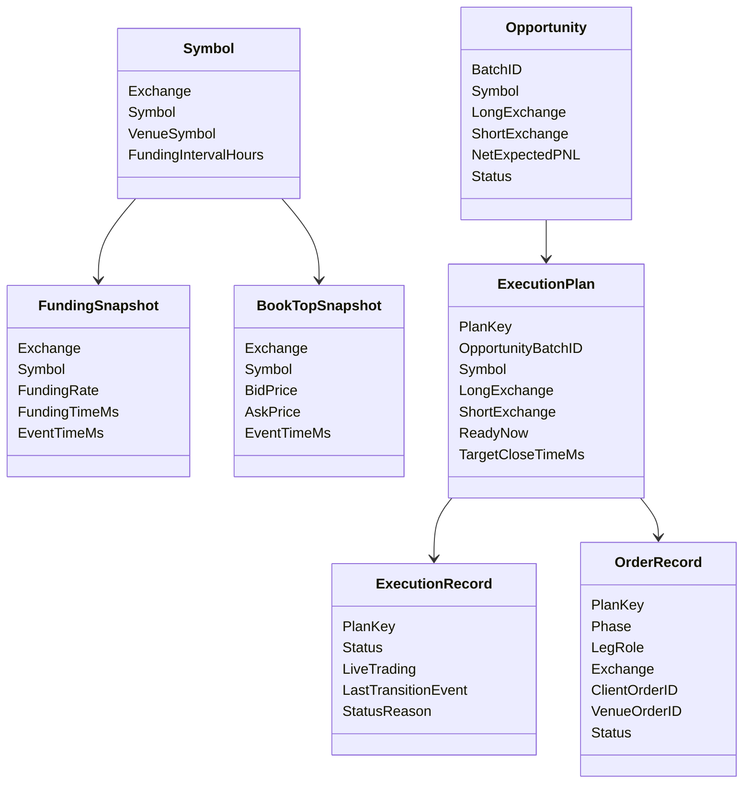
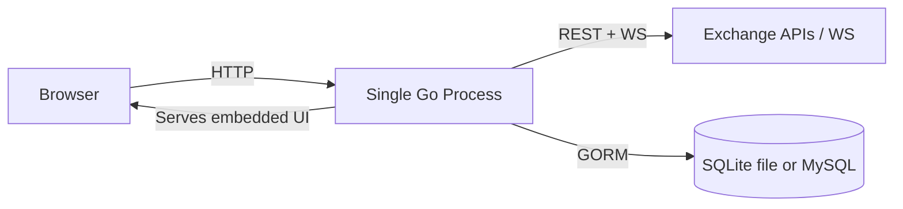
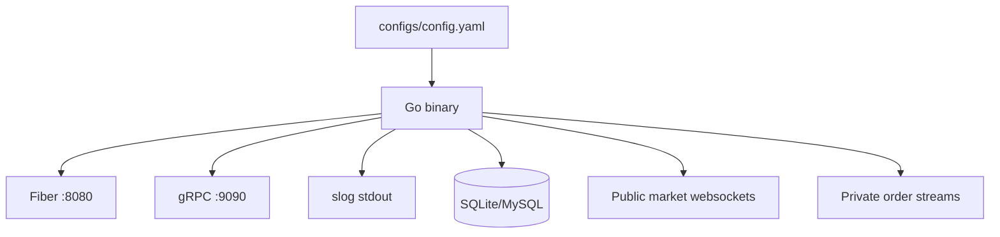

# Funding Arbitrage Monitor: Developer Discovery Guide

This document is a technical onboarding guide for the current workspace at `/Users/tp/work/person/goKit`.

It is written for a new developer who needs to understand the architecture, runtime model, core flows, extension points, and practical reading order of the codebase as quickly as possible.

## 1. README / Instruction Files Summary

### 1.1 Main README

Primary project documentation lives in [README.md](/Users/tp/work/person/goKit/README.md).

Most relevant takeaways for a new developer:

- **Project overview**
  - The system is a multi-exchange funding arbitrage monitor and execution service focused on perpetual futures.
  - It currently supports market/trade integration families for `binance_like`, `bybit_v5`, and `hyperliquid`.
  - It aims to keep strategy logic independent from exchange-specific API details by isolating those details in exchange adapters.

- **How to run locally**
  - Install dependencies with `go mod tidy`.
  - Copy or edit config under `configs/config.yaml`.
  - Start the service with `go run ./cmd/server`.
  - The HTTP server defaults to `:8080`; the gRPC server defaults to `:9090`.

- **Architecture conventions**
  - `adapter_kind` selects the concrete exchange protocol family.
  - `venue_kind` selects the strategy-side venue rules/profile family.
  - The strategy uses canonical symbols, not raw venue symbols, so cross-exchange comparisons can be computed consistently.

- **Operational hints**
  - SQLite is the default local database.
  - Strategy and execution loops are controlled by config flags.
  - The embedded web UI is served by the Go binary itself.

### 1.2 Design Docs Worth Reading

The `docs/` directory contains design history and is unusually useful in this repository:

- [docs/multi_exchange_architecture.md](/Users/tp/work/person/goKit/docs/multi_exchange_architecture.md)
  - Best high-level explanation of the multi-exchange adapter model and why `adapter_kind` is protocol-family based rather than generic `cex/dex`.
- [docs/code_design_v1_scanner_to_planner.md](/Users/tp/work/person/goKit/docs/code_design_v1_scanner_to_planner.md)
  - Explains how the system evolved from scanning to plan generation.
- [docs/code_design_v2_execution_safety.md](/Users/tp/work/person/goKit/docs/code_design_v2_execution_safety.md)
  - Explains execution safety concerns and risk controls.
- [docs/code_design_v3_registry_and_state_machine.md](/Users/tp/work/person/goKit/docs/code_design_v3_registry_and_state_machine.md)
  - Explains the newer registry/state-machine direction.
- [docs/arbitrage_algorithm_and_funding_timeline.md](/Users/tp/work/person/goKit/docs/arbitrage_algorithm_and_funding_timeline.md)
  - Useful for understanding the funding timeline model behind the opportunity calculations.
- [docs/task_breakdown_v1.md](/Users/tp/work/person/goKit/docs/task_breakdown_v1.md)
  - Useful as a roadmap and for spotting remaining gaps.

### 1.3 Contribution / Standards Files

I did **not** find `CONTRIBUTING.md`, `LEIAME.md`, `.github/workflows/`, `Dockerfile`, or similar build/deploy policy files in this workspace.

Practical implication:

- The effective standards are encoded mostly in:
  - [README.md](/Users/tp/work/person/goKit/README.md)
  - [configs/config.yaml.example](/Users/tp/work/person/goKit/configs/config.yaml.example)
  - the comments embedded directly in the Go code
  - the design docs under [docs/](/Users/tp/work/person/goKit/docs)

## 2. Detailed Technology Stack

### 2.1 Stack Summary Table

| Category | Technology | Evidence |
| --- | --- | --- |
| Language | Go 1.24.0 | [go.mod](/Users/tp/work/person/goKit/go.mod) |
| HTTP framework | Fiber v2 | [go.mod](/Users/tp/work/person/goKit/go.mod), [pkg/kit/web/server.go](/Users/tp/work/person/goKit/pkg/kit/web/server.go) |
| DI / app lifecycle | Uber Fx | [go.mod](/Users/tp/work/person/goKit/go.mod), [cmd/server/main.go](/Users/tp/work/person/goKit/cmd/server/main.go), [internal/module.go](/Users/tp/work/person/goKit/internal/module.go) |
| Config | Viper | [go.mod](/Users/tp/work/person/goKit/go.mod), [cmd/server/main.go](/Users/tp/work/person/goKit/cmd/server/main.go) |
| ORM / persistence | GORM | [go.mod](/Users/tp/work/person/goKit/go.mod), [pkg/kit/db/client.go](/Users/tp/work/person/goKit/pkg/kit/db/client.go) |
| Databases | SQLite by default, MySQL supported | [configs/config.yaml](/Users/tp/work/person/goKit/configs/config.yaml), [pkg/kit/db/client.go](/Users/tp/work/person/goKit/pkg/kit/db/client.go) |
| WebSocket client | Gorilla WebSocket | [go.mod](/Users/tp/work/person/goKit/go.mod), exchange adapters in [internal/infrastructure/exchange/](/Users/tp/work/person/goKit/internal/infrastructure/exchange) |
| RPC | gRPC | [go.mod](/Users/tp/work/person/goKit/go.mod), [pkg/kit/rpc/server.go](/Users/tp/work/person/goKit/pkg/kit/rpc/server.go) |
| Logging | `log/slog` | [pkg/kit/log/logger.go](/Users/tp/work/person/goKit/pkg/kit/log/logger.go) |
| Tracing hook | OpenTelemetry trace IDs in logs | [pkg/kit/log/handle.go](/Users/tp/work/person/goKit/pkg/kit/log/handle.go) |
| Frontend | Embedded static HTML/CSS/vanilla JS | [web/embed.go](/Users/tp/work/person/goKit/web/embed.go), [web/index.html](/Users/tp/work/person/goKit/web/index.html), [web/assets/app.js](/Users/tp/work/person/goKit/web/assets/app.js) |
| Build tool | Go toolchain + Makefile | [Makefile](/Users/tp/work/person/goKit/Makefile) |
| Test framework | Go testing package | `*_test.go` files under [internal/](/Users/tp/work/person/goKit/internal) |

### 2.2 Architecture Style

This is a **modular monolith** with clear internal layering:

- `cmd/server` for bootstrap
- `pkg/kit` for reusable infrastructure
- `internal/domain` for entities/repositories
- `internal/infrastructure` for exchange adapters and persistence
- `internal/application/service` for orchestration and business flows
- `internal/interface/http` for the API layer
- `web/` for embedded frontend assets

It is not microservices-based. The HTTP API, gRPC server, strategy engine, execution engine, embedded UI, and database access all live in one process.

### 2.3 Database

- **Primary default database:** SQLite
- **Optional alternative:** MySQL, with optional read replicas via GORM dbresolver

Evidence:

- [configs/config.yaml](/Users/tp/work/person/goKit/configs/config.yaml)
- [pkg/kit/db/config.go](/Users/tp/work/person/goKit/pkg/kit/db/config.go)
- [pkg/kit/db/client.go](/Users/tp/work/person/goKit/pkg/kit/db/client.go)

SQLite-specific optimizations:

- WAL mode
- busy timeout
- directory auto-creation

These are implemented in [pkg/kit/db/client.go](/Users/tp/work/person/goKit/pkg/kit/db/client.go).

### 2.4 External Platforms / Integrations

Detected exchange integrations:

- Binance Futures style venues
- Aster
- Bybit V5
- Hyperliquid

Evidence:

- [internal/infrastructure/exchange/registry.go](/Users/tp/work/person/goKit/internal/infrastructure/exchange/registry.go)
- [configs/config.yaml.example](/Users/tp/work/person/goKit/configs/config.yaml.example)

Detected cloud/provider SDKs:

- No strong evidence of direct AWS/Azure/GCP SDK usage in the core app path.

### 2.5 Build / Run Tooling

- Local commands are defined in [Makefile](/Users/tp/work/person/goKit/Makefile):
  - `make tidy`
  - `make run`
  - `make build`
  - `make test`
- Runtime config is file-based through [configs/config.yaml](/Users/tp/work/person/goKit/configs/config.yaml).

## 3. System Overview and Purpose

### 3.1 What the System Does

This system monitors perpetual futures markets across multiple venues, normalizes market data into a shared internal model, identifies funding arbitrage opportunities, generates execution plans, and can optionally execute and manage hedged positions.

### 3.2 Who It Is For

Primary users appear to be:

- quantitative / systematic trading developers
- operators monitoring cross-exchange funding arbitrage opportunities
- developers extending the system to more perpetual venues

### 3.3 Business Problem It Solves

The core problem is:

- exchanges expose different market data APIs, symbol conventions, signing rules, and order semantics
- funding opportunities exist only if the system can compare venues on a common symbol basis
- execution is risky because a two-leg hedge can partially fill, time out, or drift out of the valid entry window

This repository addresses that by separating:

- exchange integration
- strategy calculation
- plan generation
- execution state management

### 3.4 Core Functionalities

- Load tradable symbols from enabled venues
- Normalize venue symbols to canonical symbols
- Maintain in-memory latest funding and best-bid/ask state
- Persist funding and book snapshots
- Compute cross-venue opportunities
- Generate execution plans
- Auto-open and auto-close positions
- Record execution and order history
- Ingest external/private order events and update execution state
- Expose HTTP APIs and an embedded monitoring UI

## 4. Project Structure and Reading Recommendations

### 4.1 Entry Points

Start here first:

- [cmd/server/main.go](/Users/tp/work/person/goKit/cmd/server/main.go)
  - Bootstraps config, dependency injection, HTTP routes, and embedded frontend.
- [internal/module.go](/Users/tp/work/person/goKit/internal/module.go)
  - Wires repositories, services, adapters, handlers, migrations, and background loops.
- [pkg/kit/module.go](/Users/tp/work/person/goKit/pkg/kit/module.go)
  - Wires the reusable infrastructure layer.

Representative bootstrap snippet:

```go
func main() {
	fx.New(
		fx.Provide(LoadConfig),
		fx.Provide(func(cfg *AppConfig) service.Config { return cfg.Strategy }),
		fx.Provide(func(cfg *AppConfig) exchange.ConfigSet { return cfg.Exchanges }),
		kit.Module,
		internal.Module,
		fx.Invoke(func(app *fiber.App, router *httpInterface.Router) {
			router.Register(app)
			frontend.RegisterRoutes(app)
		}),
	).Run()
}
```

Source: [cmd/server/main.go](/Users/tp/work/person/goKit/cmd/server/main.go)

### 4.2 General Organization

Important folders:

- [cmd/server/](/Users/tp/work/person/goKit/cmd/server)
  - Application entrypoint.
- [internal/application/service/](/Users/tp/work/person/goKit/internal/application/service)
  - Core orchestration: scanning, forecasting, planning, execution, system status.
- [internal/domain/entity/](/Users/tp/work/person/goKit/internal/domain/entity)
  - Persistence/domain models.
- [internal/domain/repository/](/Users/tp/work/person/goKit/internal/domain/repository)
  - Repository interfaces.
- [internal/infrastructure/exchange/](/Users/tp/work/person/goKit/internal/infrastructure/exchange)
  - Exchange adapters, registries, symbol normalization, websocket managers.
- [internal/infrastructure/persistence/](/Users/tp/work/person/goKit/internal/infrastructure/persistence)
  - GORM repository implementations and migrations.
- [internal/interface/http/](/Users/tp/work/person/goKit/internal/interface/http)
  - REST API handlers, router, middleware, response types.
- [pkg/kit/](/Users/tp/work/person/goKit/pkg/kit)
  - Shared app infrastructure: logging, DB, HTTP server, gRPC server.
- [web/](/Users/tp/work/person/goKit/web)
  - Embedded frontend.
- [configs/](/Users/tp/work/person/goKit/configs)
  - Runtime configuration.
- [docs/](/Users/tp/work/person/goKit/docs)
  - Design docs and architecture notes.

### 4.3 Configuration

Most important config files:

- [configs/config.yaml](/Users/tp/work/person/goKit/configs/config.yaml)
  - Current local runtime config.
- [configs/config.yaml.example](/Users/tp/work/person/goKit/configs/config.yaml.example)
  - Richly commented example config and the best source for ops intent.

Critical config areas:

- `strategy.enabled`
- `strategy.execution.enabled`
- `strategy.allowed_symbols`
- `strategy.hold_hours`
- `strategy.execution.*` risk and timing controls
- `exchanges.<name>.adapter_kind`
- `exchanges.<name>.venue_kind`
- `exchanges.<name>.rest_base_url`
- `exchanges.<name>.public_ws_base_url`
- `exchanges.<name>.private_ws_base_url`
- `exchanges.<name>.auth.*`

### 4.4 Recommended Reading Order

Suggested reading order for a new developer:

1. [README.md](/Users/tp/work/person/goKit/README.md)
2. [cmd/server/main.go](/Users/tp/work/person/goKit/cmd/server/main.go)
3. [internal/module.go](/Users/tp/work/person/goKit/internal/module.go)
4. [internal/infrastructure/exchange/interfaces.go](/Users/tp/work/person/goKit/internal/infrastructure/exchange/interfaces.go)
5. [internal/infrastructure/exchange/registry.go](/Users/tp/work/person/goKit/internal/infrastructure/exchange/registry.go)
6. [internal/application/service/market_store.go](/Users/tp/work/person/goKit/internal/application/service/market_store.go)
7. [internal/application/service/strategy_runner.go](/Users/tp/work/person/goKit/internal/application/service/strategy_runner.go)
8. [internal/application/service/funding_forecaster.go](/Users/tp/work/person/goKit/internal/application/service/funding_forecaster.go)
9. [internal/application/service/planning.go](/Users/tp/work/person/goKit/internal/application/service/planning.go)
10. [internal/application/service/execution_service.go](/Users/tp/work/person/goKit/internal/application/service/execution_service.go)
11. [internal/application/service/execution_state_machine.go](/Users/tp/work/person/goKit/internal/application/service/execution_state_machine.go)
12. [internal/interface/http/router/router.go](/Users/tp/work/person/goKit/internal/interface/http/router/router.go)
13. [web/index.html](/Users/tp/work/person/goKit/web/index.html) and [web/assets/app.js](/Users/tp/work/person/goKit/web/assets/app.js)

## 5. Key Components

### 5.1 Dependency Wiring Module

Implementation:

- [internal/module.go](/Users/tp/work/person/goKit/internal/module.go)

Responsibility:

- Central Fx wiring for repositories, services, exchange factories/adapters, handlers, migrations, strategy runner, and execution engine.

Representative snippet:

```go
var Module = fx.Options(
	fx.Provide(
		persistence.NewSymbolRepository,
		persistence.NewMarketDataRepository,
		service.NewMarketStore,
		fx.Annotate(exchange.DefaultAdapterFactories, fx.ResultTags(`group:"exchange_adapter_factories,flatten"`)),
		exchange.NewProvidedAdapterRegistry,
		fx.Annotate(exchange.ProvideMarketAdapters, fx.ResultTags(`group:"markets,flatten"`)),
		fx.Annotate(exchange.ProvideTradeAdapters, fx.ResultTags(`group:"trades,flatten"`)),
		service.NewStrategyRunner,
		service.NewExecutionService,
		httpRouter.NewRouter,
	),
	fx.Invoke(
		persistence.AutoMigrate,
		service.StartStrategyRunner,
		service.StartExecutionEngine,
	),
)
```

Why it matters:

- This file gives you the real runtime composition of the app in one place.

### 5.2 Exchange Adapter Interfaces

Implementation:

- [internal/infrastructure/exchange/interfaces.go](/Users/tp/work/person/goKit/internal/infrastructure/exchange/interfaces.go)

Responsibility:

- Defines the contract between exchange integrations and the rest of the system.
- Splits market ingestion from trading behavior.

Representative snippet:

```go
type MarketAdapter interface {
	Name() string
	Enabled() bool
	Fees() FeeConfig
	Config() ExchangeConfig
	FetchTradableSymbols(ctx context.Context, quoteAsset string, allowed map[string]struct{}) ([]entity.Symbol, error)
	Start(ctx context.Context, provider MarketSubscriptionProvider, sink MarketSink)
}

type TradeAdapter interface {
	Name() string
	Enabled() bool
	Capabilities() TradeCapabilities
	PlaceOrder(ctx context.Context, req TradeOrderRequest) (TradeOrderResult, error)
	ClosePosition(ctx context.Context, req TradeOrderRequest) (TradeOrderResult, error)
	GetPosition(ctx context.Context, canonicalSymbol, venueSymbol, assetID string) (Position, error)
	GetOrderStatus(ctx context.Context, req OrderLookupRequest) (OrderStatus, error)
	GetAccountSnapshot(ctx context.Context) (AccountSnapshot, error)
}
```

Why it matters:

- These abstractions are the foundation for adding more perpetual venues without rewriting strategy logic.

### 5.3 Adapter Registry

Implementation:

- [internal/infrastructure/exchange/registry.go](/Users/tp/work/person/goKit/internal/infrastructure/exchange/registry.go)

Responsibility:

- Maps `adapter_kind` to concrete market/trade adapter factories.
- Supports built-in and injected adapter families through Fx groups.

Why it matters:

- This is the main extensibility seam for future venues like OKX perpetuals.

### 5.4 MarketStore

Implementation:

- [internal/application/service/market_store.go](/Users/tp/work/person/goKit/internal/application/service/market_store.go)

Responsibility:

- In-memory latest-state cache for symbols, funding snapshots, book snapshots, connector health, watchlists, and deep-scan watchlists.

Representative snippet:

```go
type MarketStore struct {
	mu       sync.RWMutex
	symbols  map[string]map[string]entity.Symbol
	funding  map[string]map[string]entity.FundingSnapshot
	bookTop  map[string]map[string]entity.BookTopSnapshot
	statuses map[string]exchange.ConnectorStatus
	watchlist []string
	deepScanWatchlist []string
}
```

Why it matters:

- It is the shared read model for strategy calculation, execution revalidation, and the HTTP/UI query layer.

### 5.5 StrategyRunner

Implementation:

- [internal/application/service/strategy_runner.go](/Users/tp/work/person/goKit/internal/application/service/strategy_runner.go)

Responsibility:

- Loads tradable symbols from all enabled exchanges.
- Builds multi-venue watchlists.
- Starts market adapters.
- Runs funding-based coarse screening.
- Maintains a dynamic deep-scan book watchlist.
- Persists snapshots and calculates opportunities/plans.

Representative snippet:

```go
type StrategyRunner struct {
	cfg        Config
	store      *MarketStore
	oppRepo    repository.OpportunityRepository
	planRepo   repository.ExecutionPlanRepository
	markets    map[string]exchange.MarketAdapter
	forecaster FundingForecaster
	venues     *VenueProfileRegistry
	fundingSymbolsByExchange map[string][]entity.Symbol
	bookSymbolsByExchange    map[string][]entity.Symbol
}
```

Why it matters:

- This is the heart of the scanner/planner side of the system.

### 5.6 FundingForecaster

Implementation:

- [internal/application/service/funding_forecaster.go](/Users/tp/work/person/goKit/internal/application/service/funding_forecaster.go)

Responsibility:

- Uses current funding plus recent persisted funding history to produce a regime-aware funding forecast.
- Applies venue-specific clamps via `VenueProfileRegistry`.

Why it matters:

- The opportunity engine is not a simple spot snapshot comparison; it uses a forecast model with guardrails.

### 5.7 ExecutionService

Implementation:

- [internal/application/service/execution_service.go](/Users/tp/work/person/goKit/internal/application/service/execution_service.go)
- [internal/application/service/execution_state_machine.go](/Users/tp/work/person/goKit/internal/application/service/execution_state_machine.go)
- [internal/application/service/execution_event_ingest.go](/Users/tp/work/person/goKit/internal/application/service/execution_event_ingest.go)
- [internal/application/service/execution_event_stream.go](/Users/tp/work/person/goKit/internal/application/service/execution_event_stream.go)
- [internal/application/service/execution_risk_guards.go](/Users/tp/work/person/goKit/internal/application/service/execution_risk_guards.go)

Responsibility:

- Starts the execution loop.
- Auto-opens ready plans.
- Auto-closes live or recovery records.
- Tracks per-plan execution status.
- Records order details.
- Ingests asynchronous order events from private streams or HTTP injection.
- Revalidates plans before opening and applies risk/drawdown guards before closing.

Representative snippet:

```go
func StartExecutionEngine(lc fx.Lifecycle, svc *ExecutionService) {
	var cancel context.CancelFunc
	lc.Append(fx.Hook{
		OnStart: func(ctx context.Context) error {
			runCtx, c := context.WithCancel(context.Background())
			cancel = c
			go svc.orderEventLoop(runCtx)
			svc.startTradeOrderStreams(runCtx)
			go svc.loop(runCtx)
			return nil
		},
	})
}
```

Why it matters:

- This is where the system becomes a trading engine rather than just a monitor.

### 5.8 HTTP API Layer

Implementation:

- [internal/interface/http/router/router.go](/Users/tp/work/person/goKit/internal/interface/http/router/router.go)
- handlers under [internal/interface/http/handler/](/Users/tp/work/person/goKit/internal/interface/http/handler)

Responsibility:

- Exposes symbols, opportunities, plans, executions, system status, snapshot stats, manual open/close, and external order event injection.

Representative endpoints:

- `GET /api/v1/health`
- `GET /api/v1/symbols`
- `GET /api/v1/opportunities`
- `GET /api/v1/execution-plans`
- `GET /api/v1/executions`
- `POST /api/v1/executions/:planKey/open`
- `POST /api/v1/executions/:planKey/close`
- `POST /api/v1/executions/events/order`
- `GET /api/v1/market/:symbol`
- `GET /api/v1/system/status`
- `GET /api/v1/stats/snapshots`

### 5.9 Embedded Frontend

Implementation:

- [web/embed.go](/Users/tp/work/person/goKit/web/embed.go)
- [web/index.html](/Users/tp/work/person/goKit/web/index.html)
- [web/assets/app.js](/Users/tp/work/person/goKit/web/assets/app.js)

Responsibility:

- Provides a lightweight operator console for monitoring strategy settings, system health, market state, opportunities, plans, and execution records.

Notable characteristic:

- The frontend is embedded into the Go binary, so deployment is simple: one process serves both API and UI.

## 6. Execution and Data Flows

### 6.1 Startup Flow

1. [cmd/server/main.go](/Users/tp/work/person/goKit/cmd/server/main.go) loads config with Viper.
2. Fx constructs infrastructure through [pkg/kit/module.go](/Users/tp/work/person/goKit/pkg/kit/module.go) and application services through [internal/module.go](/Users/tp/work/person/goKit/internal/module.go).
3. [internal/infrastructure/persistence/migrate.go](/Users/tp/work/person/goKit/internal/infrastructure/persistence/migrate.go) auto-migrates tables.
4. [service.StartStrategyRunner](/Users/tp/work/person/goKit/internal/application/service/strategy_runner.go) starts market ingestion / planning loops.
5. [service.StartExecutionEngine](/Users/tp/work/person/goKit/internal/application/service/execution_service.go) starts execution and order-event loops.
6. HTTP routes and embedded frontend are registered.

### 6.2 Market Ingestion and Opportunity Flow

High-level flow:

1. Each enabled `MarketAdapter` fetches tradable symbols.
2. `StrategyRunner` builds a cross-venue watchlist of canonical symbols present on at least two venues.
3. `StrategyRunner` starts adapters with a `MarketSubscriptionProvider`.
4. Adapters push symbol/funding/book updates into `MarketStore`.
5. Snapshots are periodically persisted through `MarketDataRepository`.
6. `StrategyRunner` calculates opportunities from the latest in-memory state and persisted funding history.
7. Eligible opportunities are saved.
8. Execution plans are generated and saved.

Important files:

- [internal/application/service/strategy_runner.go](/Users/tp/work/person/goKit/internal/application/service/strategy_runner.go)
- [internal/application/service/market_store.go](/Users/tp/work/person/goKit/internal/application/service/market_store.go)
- [internal/application/service/funding_forecaster.go](/Users/tp/work/person/goKit/internal/application/service/funding_forecaster.go)
- [internal/application/service/planning.go](/Users/tp/work/person/goKit/internal/application/service/planning.go)

### 6.3 Execution Flow

High-level flow:

1. `ExecutionService` reads recent plans.
2. If a plan is `ready`, it revalidates current market conditions before opening.
3. It places the two primary legs concurrently.
4. It reconciles immediate order results and may enter hedge/recovery states on failure.
5. It persists `ExecutionRecord` and `OrderRecord`.
6. Auto-close later triggers based on schedule or risk guards.

Important files:

- [internal/application/service/execution_service.go](/Users/tp/work/person/goKit/internal/application/service/execution_service.go)
- [internal/application/service/execution_risk_guards.go](/Users/tp/work/person/goKit/internal/application/service/execution_risk_guards.go)
- [internal/application/service/execution_state_machine.go](/Users/tp/work/person/goKit/internal/application/service/execution_state_machine.go)

### 6.4 External / Private Order Event Flow

High-level flow:

1. Some trade adapters implement `TradeOrderEventStreamer`.
2. Private websocket/user-stream events are mapped to `exchange.OrderEvent`.
3. `ExecutionService.orderEventLoop` translates them into `ExternalOrderEvent`.
4. `ApplyExternalOrderEvent` merges them into `OrderRecord`.
5. The execution state machine summarizes all orders for the plan and updates `ExecutionRecord`.

Important files:

- [internal/infrastructure/exchange/interfaces.go](/Users/tp/work/person/goKit/internal/infrastructure/exchange/interfaces.go)
- [internal/application/service/execution_event_stream.go](/Users/tp/work/person/goKit/internal/application/service/execution_event_stream.go)
- [internal/application/service/execution_event_ingest.go](/Users/tp/work/person/goKit/internal/application/service/execution_event_ingest.go)

### 6.5 Market Streaming Model

The market side is optimized around two subscription tiers:

- **Funding tier**
  - Broad, cheaper, used for coarse screening.
- **Book tier**
  - Narrower, higher-frequency, used for deep-scan opportunity precision.

Examples:

- Bybit public market stream uses `tickers.{symbol}` plus `orderbook.1.{symbol}`.
- Binance-like book streaming uses a dynamic websocket stream manager.

Important files:

- [internal/infrastructure/exchange/bybit_market.go](/Users/tp/work/person/goKit/internal/infrastructure/exchange/bybit_market.go)
- [internal/infrastructure/exchange/cex_market.go](/Users/tp/work/person/goKit/internal/infrastructure/exchange/cex_market.go)
- [internal/infrastructure/exchange/dynamic_public_stream_manager.go](/Users/tp/work/person/goKit/internal/infrastructure/exchange/dynamic_public_stream_manager.go)

### 6.6 Database Schema Overview

Main entities:

| Entity | Purpose | Key relationships |
| --- | --- | --- |
| [Symbol](/Users/tp/work/person/goKit/internal/domain/entity/symbol.go) | Canonical + venue symbol metadata | Referenced indirectly by market store and plan generation |
| [FundingSnapshot](/Users/tp/work/person/goKit/internal/domain/entity/funding_snapshot.go) | Latest/persisted funding state | Historical input to funding forecaster |
| [BookTopSnapshot](/Users/tp/work/person/goKit/internal/domain/entity/book_top_snapshot.go) | Latest/persisted best bid/ask | Used in opportunity precision and execution guards |
| [Opportunity](/Users/tp/work/person/goKit/internal/domain/entity/opportunity.go) | Computed arbitrage candidate | Source for execution plan generation |
| [ExecutionPlan](/Users/tp/work/person/goKit/internal/domain/entity/execution_plan.go) | Concrete trade plan | Linked to `ExecutionRecord` and `OrderRecord` through `PlanKey` |
| [ExecutionRecord](/Users/tp/work/person/goKit/internal/domain/entity/execution_record.go) | Current/last execution state | One per plan key |
| [OrderRecord](/Users/tp/work/person/goKit/internal/domain/entity/order_record.go) | Individual order-level history | Many per plan key |

Relationship summary:

- `Opportunity.BatchID` groups a calculation batch.
- `ExecutionPlan.OpportunityBatchID` links plans back to opportunity batches.
- `ExecutionRecord.PlanKey` is the primary execution identity.
- `OrderRecord.PlanKey` attaches order history to a plan/execution.

Migration entrypoint:

- [internal/infrastructure/persistence/migrate.go](/Users/tp/work/person/goKit/internal/infrastructure/persistence/migrate.go)

## 7. Dependencies and Integrations

### 7.1 Main Libraries

| Library | Role | Evidence |
| --- | --- | --- |
| `github.com/gofiber/fiber/v2` | HTTP server and middleware | [go.mod](/Users/tp/work/person/goKit/go.mod), [pkg/kit/web/server.go](/Users/tp/work/person/goKit/pkg/kit/web/server.go) |
| `go.uber.org/fx` | Dependency injection and lifecycle | [go.mod](/Users/tp/work/person/goKit/go.mod), [cmd/server/main.go](/Users/tp/work/person/goKit/cmd/server/main.go) |
| `github.com/spf13/viper` | Config loading | [cmd/server/main.go](/Users/tp/work/person/goKit/cmd/server/main.go) |
| `gorm.io/gorm` | ORM and DB access | [pkg/kit/db/client.go](/Users/tp/work/person/goKit/pkg/kit/db/client.go) |
| `github.com/gorilla/websocket` | Exchange websocket clients | [go.mod](/Users/tp/work/person/goKit/go.mod), exchange adapters |
| `google.golang.org/grpc` | gRPC server scaffold | [pkg/kit/rpc/server.go](/Users/tp/work/person/goKit/pkg/kit/rpc/server.go) |
| `log/slog` | Structured logging | [pkg/kit/log/logger.go](/Users/tp/work/person/goKit/pkg/kit/log/logger.go) |
| `go.opentelemetry.io/otel/trace` | Trace ID enrichment in logs | [pkg/kit/log/handle.go](/Users/tp/work/person/goKit/pkg/kit/log/handle.go) |

### 7.2 External Integrations

Detected integration classes:

- Exchange REST APIs
- Exchange public websockets
- Exchange private order/user streams
- SQLite/MySQL database

Where exchange communication happens:

- [internal/infrastructure/exchange/](/Users/tp/work/person/goKit/internal/infrastructure/exchange)

Examples:

- [internal/infrastructure/exchange/bybit_market.go](/Users/tp/work/person/goKit/internal/infrastructure/exchange/bybit_market.go)
- [internal/infrastructure/exchange/bybit_trade.go](/Users/tp/work/person/goKit/internal/infrastructure/exchange/bybit_trade.go)
- [internal/infrastructure/exchange/bybit_order_event_stream.go](/Users/tp/work/person/goKit/internal/infrastructure/exchange/bybit_order_event_stream.go)
- [internal/infrastructure/exchange/cex_market.go](/Users/tp/work/person/goKit/internal/infrastructure/exchange/cex_market.go)
- [internal/infrastructure/exchange/cex_trade.go](/Users/tp/work/person/goKit/internal/infrastructure/exchange/cex_trade.go)
- [internal/infrastructure/exchange/hyperliquid_trade.go](/Users/tp/work/person/goKit/internal/infrastructure/exchange/hyperliquid_trade.go)

### 7.3 API Documentation

There is **no Swagger/OpenAPI spec** in the repository.

The effective API documentation sources are:

- [README.md](/Users/tp/work/person/goKit/README.md)
- [internal/interface/http/router/router.go](/Users/tp/work/person/goKit/internal/interface/http/router/router.go)
- handlers in [internal/interface/http/handler/](/Users/tp/work/person/goKit/internal/interface/http/handler)

## 8. Diagrams

### 8.1 Component Diagram



### 8.2 Data Flow Diagram



### 8.3 Simplified Class / Domain Diagram



### 8.4 Simplified Deployment Diagram



### 8.5 Simplified Infrastructure Diagram



## 9. Testing

### 9.1 Are There Automated Tests?

Yes.

Detected test files:

- [internal/application/service/execution_service_test.go](/Users/tp/work/person/goKit/internal/application/service/execution_service_test.go)
- [internal/application/service/strategy_runner_funding_test.go](/Users/tp/work/person/goKit/internal/application/service/strategy_runner_funding_test.go)
- [internal/application/service/strategy_runner_symbol_test.go](/Users/tp/work/person/goKit/internal/application/service/strategy_runner_symbol_test.go)
- [internal/application/service/venue_profile_test.go](/Users/tp/work/person/goKit/internal/application/service/venue_profile_test.go)
- [internal/domain/entity/opportunity_test.go](/Users/tp/work/person/goKit/internal/domain/entity/opportunity_test.go)
- [internal/infrastructure/exchange/bybit_market_trade_test.go](/Users/tp/work/person/goKit/internal/infrastructure/exchange/bybit_market_trade_test.go)
- [internal/infrastructure/exchange/bybit_order_event_stream_test.go](/Users/tp/work/person/goKit/internal/infrastructure/exchange/bybit_order_event_stream_test.go)
- [internal/infrastructure/exchange/cex_order_event_stream_test.go](/Users/tp/work/person/goKit/internal/infrastructure/exchange/cex_order_event_stream_test.go)
- [internal/infrastructure/exchange/close_quantity_test.go](/Users/tp/work/person/goKit/internal/infrastructure/exchange/close_quantity_test.go)
- [internal/infrastructure/exchange/common_test.go](/Users/tp/work/person/goKit/internal/infrastructure/exchange/common_test.go)
- [internal/infrastructure/exchange/registry_test.go](/Users/tp/work/person/goKit/internal/infrastructure/exchange/registry_test.go)
- [internal/interface/http/handler/execution_handler_test.go](/Users/tp/work/person/goKit/internal/interface/http/handler/execution_handler_test.go)

### 9.2 Testing Style

Mainly present:

- unit tests
- service-level tests
- adapter parsing/behavior tests
- handler tests

I did **not** find a separate end-to-end test suite or browser automation suite.

### 9.3 How to Run Tests

Local commands:

- `go test ./...`
- `make test`

I ran `go test ./...` in this workspace during analysis, and it passed.

### 9.4 CI/CD Strategy

I did **not** find repository CI definitions such as:

- `.github/workflows/`
- `.gitlab-ci.yml`

So tests appear to be locally runnable and repository-owned, but CI policy is not checked in here.

## 10. Error Handling and Logging

### 10.1 HTTP Error Handling

HTTP errors are normalized via:

- [internal/interface/http/middleware/error_handler.go](/Users/tp/work/person/goKit/internal/interface/http/middleware/error_handler.go)
- [internal/interface/http/response/errors.go](/Users/tp/work/person/goKit/internal/interface/http/response/errors.go)

Pattern:

- Handlers return typed `AppError` values for business errors.
- Middleware maps them to JSON responses.
- Unknown errors become HTTP 500 with a generic payload.

### 10.2 Logging

Logging uses `slog`:

- [pkg/kit/log/logger.go](/Users/tp/work/person/goKit/pkg/kit/log/logger.go)
- [pkg/kit/log/config.go](/Users/tp/work/person/goKit/pkg/kit/log/config.go)

Supported logging config:

- level: `debug/info/warn/error`
- format: `json/text`
- optional source file/line inclusion

### 10.3 Trace / Request Correlation

[pkg/kit/log/handle.go](/Users/tp/work/person/goKit/pkg/kit/log/handle.go) enriches logs with:

- Fiber request IDs, when present
- OpenTelemetry trace IDs, when present

### 10.4 gRPC Error Handling

[pkg/kit/rpc/server.go](/Users/tp/work/person/goKit/pkg/kit/rpc/server.go) includes:

- panic recovery interceptors
- validator interceptors
- optional auth interceptors

Notable caveat:

- The gRPC server infrastructure exists, but this repo currently looks primarily HTTP/UI-driven; I did not find business gRPC service implementations in the inspected files.

## 11. Security Considerations

### 11.1 Authentication / Authorization

Observed state:

- HTTP API has **no evident auth layer** in the current router/handler stack.
- gRPC infrastructure supports optional auth interceptors, but no concrete auth function is wired in the inspected application bootstrap.

Implication:

- Treat the HTTP server as an internal/trusted-network tool unless an auth layer is added.

### 11.2 Secrets Management

Secrets are expected from environment variables referenced in config, for example:

- `BINANCE_API_KEY`
- `BINANCE_API_SECRET`
- `ASTER_API_KEY`
- `ASTER_API_SECRET`
- `HYPERLIQUID_PRIVATE_KEY`

Evidence:

- [configs/config.yaml](/Users/tp/work/person/goKit/configs/config.yaml)
- [configs/config.yaml.example](/Users/tp/work/person/goKit/configs/config.yaml.example)

This is better than hardcoding secrets in source, but there is no separate secret manager integration evident in the repo.

### 11.3 Input Validation

Observed patterns:

- HTTP handlers validate required route/query/body fields manually.
- gRPC infrastructure includes validator interceptors for protobuf-generated validators, but actual service definitions were not found in the inspected code path.

### 11.4 Exchange Safety / Execution Safety

There is meaningful domain-specific safety logic:

- plan revalidation before opening
- drawdown/basis/balance guards for closing
- explicit execution transition graph
- recovery states for partial failures
- asynchronous order-event ingestion

Key files:

- [internal/application/service/execution_risk_guards.go](/Users/tp/work/person/goKit/internal/application/service/execution_risk_guards.go)
- [internal/application/service/execution_state_machine.go](/Users/tp/work/person/goKit/internal/application/service/execution_state_machine.go)

## 12. Other Relevant Observations (Including Build/Deploy)

### 12.1 Build / Deploy Files

Found:

- [Makefile](/Users/tp/work/person/goKit/Makefile)
- [configs/config.yaml](/Users/tp/work/person/goKit/configs/config.yaml)
- [configs/config.yaml.example](/Users/tp/work/person/goKit/configs/config.yaml.example)

Not found:

- `Dockerfile`
- `docker-compose.yml`
- checked-in CI pipelines

Practical implication:

- The simplest expected deployment model is likely: build one Go binary, ship config, run it near a local SQLite file or a MySQL instance.

### 12.2 Frontend / Backend Coupling

The frontend is intentionally lightweight and tightly coupled to the backend API:

- It polls API endpoints directly.
- It is embedded into the binary.
- It serves operational visibility, not a separate product surface.

### 12.3 Important Architectural Boundaries

This codebase is **not** a generic “any exchange, any product type” trading platform.

It is currently specialized around:

- perpetual futures
- funding arbitrage
- two-leg hedged execution

That specialization is visible in:

- `FundingSnapshot`
- `FundingForecaster`
- `ExecutionPlan`
- `ClosePosition`
- venue profile logic

### 12.4 Current Strengths

- Clear layering
- Good adapter abstraction direction
- Strong in-code comments
- Useful design docs
- Event-driven execution state model has been meaningfully started
- Dynamic public stream management already exists

### 12.5 Important Current Limitations

- No checked-in auth for HTTP
- No checked-in CI/CD pipeline
- No Swagger/OpenAPI
- gRPC scaffold exists but appears underused
- Still focused on a narrow product domain rather than a universal trading engine

### 12.6 Best Next Steps for a New Developer

If your goal is to become productive quickly, the highest-value learning path is:

1. Read [README.md](/Users/tp/work/person/goKit/README.md) and [configs/config.yaml.example](/Users/tp/work/person/goKit/configs/config.yaml.example).
2. Trace startup through [cmd/server/main.go](/Users/tp/work/person/goKit/cmd/server/main.go) and [internal/module.go](/Users/tp/work/person/goKit/internal/module.go).
3. Understand the adapter boundary in [internal/infrastructure/exchange/interfaces.go](/Users/tp/work/person/goKit/internal/infrastructure/exchange/interfaces.go) and [internal/infrastructure/exchange/registry.go](/Users/tp/work/person/goKit/internal/infrastructure/exchange/registry.go).
4. Understand the strategy path in [internal/application/service/market_store.go](/Users/tp/work/person/goKit/internal/application/service/market_store.go), [internal/application/service/strategy_runner.go](/Users/tp/work/person/goKit/internal/application/service/strategy_runner.go), [internal/application/service/funding_forecaster.go](/Users/tp/work/person/goKit/internal/application/service/funding_forecaster.go), and [internal/application/service/planning.go](/Users/tp/work/person/goKit/internal/application/service/planning.go).
5. Understand the execution path in [internal/application/service/execution_service.go](/Users/tp/work/person/goKit/internal/application/service/execution_service.go), [internal/application/service/execution_state_machine.go](/Users/tp/work/person/goKit/internal/application/service/execution_state_machine.go), and [internal/application/service/execution_event_ingest.go](/Users/tp/work/person/goKit/internal/application/service/execution_event_ingest.go).
6. Finally, inspect [web/assets/app.js](/Users/tp/work/person/goKit/web/assets/app.js) and [internal/interface/http/router/router.go](/Users/tp/work/person/goKit/internal/interface/http/router/router.go) to connect backend data to the operator UI.

