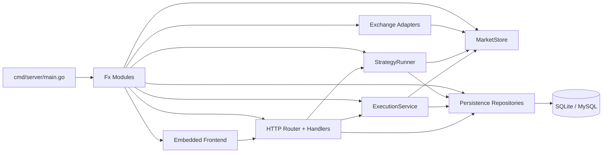
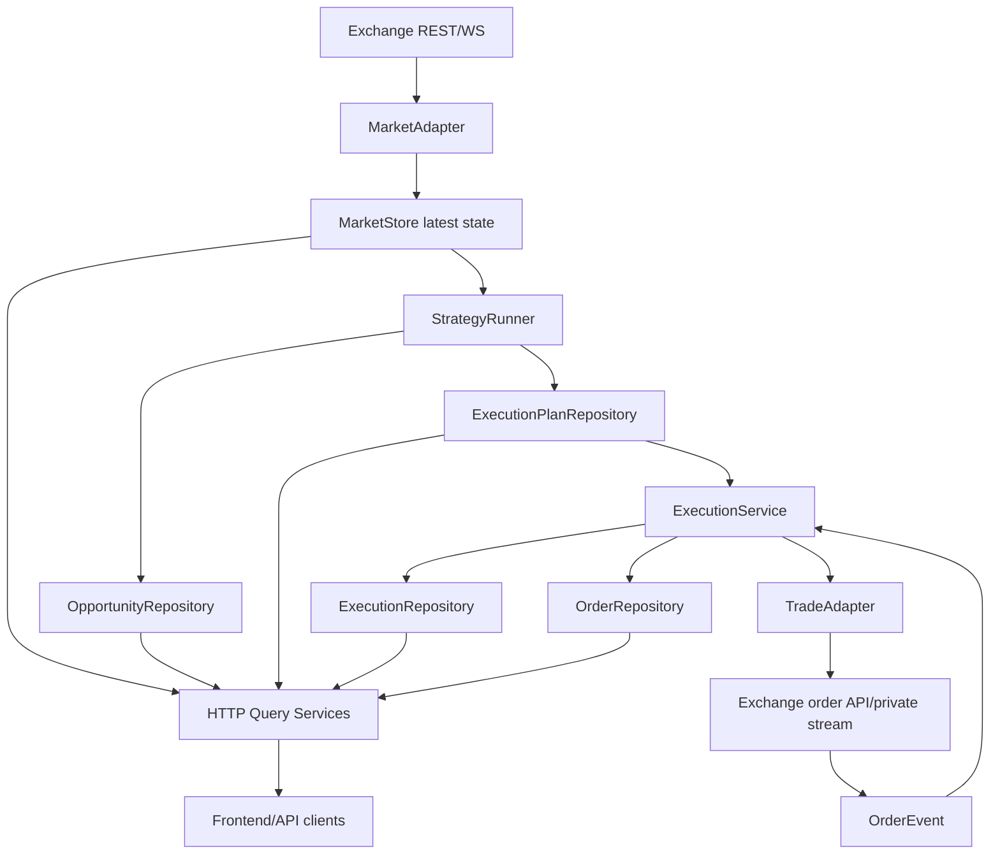
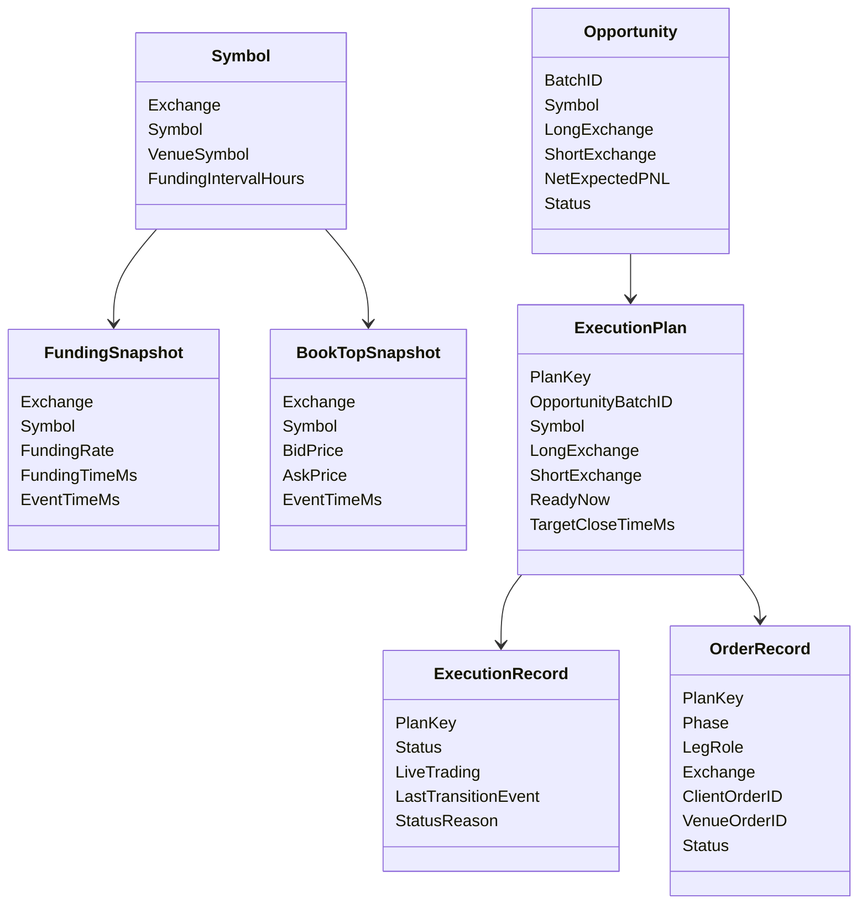
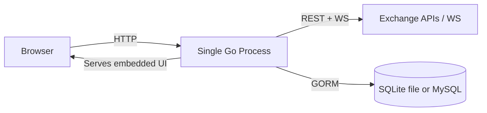
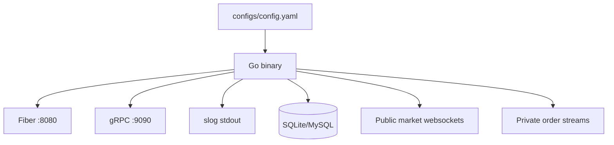

# Funding Arbitrage Monitor：开发者项目认知指南

本文档是针对当前工作区 `/Users/tp/work/person/goKit` 编写的技术 onboarding 文档。

目标读者是刚加入项目、需要尽快理解代码库架构、运行模型、核心流程、扩展点与推荐阅读顺序的开发者。

## 1. README / 说明文件总结

### 1.1 主 README

主文档位于 [README.md](/Users/tp/work/person/goKit/README.md)。

对新开发者最重要的内容如下：

- **项目概览**
  - 这是一个面向永续合约的多交易所资金费率套利监控与执行系统。
  - 当前支持的市场/交易接入协议族包括 `binance_like`、`bybit_v5` 和 `hyperliquid`。
  - 系统目标是通过交易所适配器隔离 API 差异，让策略逻辑不依赖具体交易所实现细节。

- **本地运行方式**
  - 使用 `go mod tidy` 安装依赖。
  - 准备并修改 `configs/config.yaml`。
  - 通过 `go run ./cmd/server` 启动服务。
  - HTTP 默认监听 `:8080`，gRPC 默认监听 `:9090`。

- **架构约定**
  - `adapter_kind` 选择底层交易所协议族。
  - `venue_kind` 选择策略层复用的 venue 规则族。
  - 策略统一使用 canonical symbol，而不是交易所原始 symbol，以便做跨所比较。

- **运维提示**
  - 本地默认数据库是 SQLite。
  - 策略循环与执行循环都由配置开关控制。
  - 前端页面是嵌入到 Go 二进制中的。

### 1.2 值得优先阅读的设计文档

`docs/` 目录下的设计文档对理解本仓库非常有帮助：

- [docs/multi_exchange_architecture.md](/Users/tp/work/person/goKit/docs/multi_exchange_architecture.md)
  - 最适合先读的高层架构说明，解释了多交易所适配模型，以及为什么 `adapter_kind` 是按协议族而不是按 `cex/dex` 这种大类划分。
- [docs/code_design_v1_scanner_to_planner.md](/Users/tp/work/person/goKit/docs/code_design_v1_scanner_to_planner.md)
  - 解释系统如何从 scanner 逐步演进到 planner。
- [docs/code_design_v2_execution_safety.md](/Users/tp/work/person/goKit/docs/code_design_v2_execution_safety.md)
  - 解释执行安全和风险控制思路。
- [docs/code_design_v3_registry_and_state_machine.md](/Users/tp/work/person/goKit/docs/code_design_v3_registry_and_state_machine.md)
  - 解释 registry 化与状态机方向的后续设计。
- [docs/arbitrage_algorithm_and_funding_timeline.md](/Users/tp/work/person/goKit/docs/arbitrage_algorithm_and_funding_timeline.md)
  - 适合理解资金费率时间轴和机会计算模型。
- [docs/task_breakdown_v1.md](/Users/tp/work/person/goKit/docs/task_breakdown_v1.md)
  - 可以当作 roadmap，也能帮助识别当前系统还未完成的部分。

### 1.3 贡献规范 / 标准文件

我在当前工作区中 **没有** 发现以下文件：

- `CONTRIBUTING.md`
- `LEIAME.md`
- `.github/workflows/`
- `Dockerfile`
- 其他明确的构建/部署规范文件

这意味着当前项目的“约定”主要体现在：

- [README.md](/Users/tp/work/person/goKit/README.md)
- [configs/config.yaml.example](/Users/tp/work/person/goKit/configs/config.yaml.example)
- Go 源码中的详细注释
- [docs/](/Users/tp/work/person/goKit/docs) 下的设计文档

## 2. 详细技术栈

### 2.1 技术栈总览

| 类别 | 技术 | 依据 |
| --- | --- | --- |
| 语言 | Go 1.24.0 | [go.mod](/Users/tp/work/person/goKit/go.mod) |
| HTTP 框架 | Fiber v2 | [go.mod](/Users/tp/work/person/goKit/go.mod), [pkg/kit/web/server.go](/Users/tp/work/person/goKit/pkg/kit/web/server.go) |
| 依赖注入 / 生命周期 | Uber Fx | [go.mod](/Users/tp/work/person/goKit/go.mod), [cmd/server/main.go](/Users/tp/work/person/goKit/cmd/server/main.go), [internal/module.go](/Users/tp/work/person/goKit/internal/module.go) |
| 配置管理 | Viper | [go.mod](/Users/tp/work/person/goKit/go.mod), [cmd/server/main.go](/Users/tp/work/person/goKit/cmd/server/main.go) |
| ORM / 持久化 | GORM | [go.mod](/Users/tp/work/person/goKit/go.mod), [pkg/kit/db/client.go](/Users/tp/work/person/goKit/pkg/kit/db/client.go) |
| 数据库 | 默认 SQLite，支持 MySQL | [configs/config.yaml](/Users/tp/work/person/goKit/configs/config.yaml), [pkg/kit/db/client.go](/Users/tp/work/person/goKit/pkg/kit/db/client.go) |
| WebSocket 客户端 | Gorilla WebSocket | [go.mod](/Users/tp/work/person/goKit/go.mod), [internal/infrastructure/exchange/](/Users/tp/work/person/goKit/internal/infrastructure/exchange) |
| RPC | gRPC | [go.mod](/Users/tp/work/person/goKit/go.mod), [pkg/kit/rpc/server.go](/Users/tp/work/person/goKit/pkg/kit/rpc/server.go) |
| 日志 | `log/slog` | [pkg/kit/log/logger.go](/Users/tp/work/person/goKit/pkg/kit/log/logger.go) |
| 链路追踪接入 | OpenTelemetry Trace ID 注入日志 | [pkg/kit/log/handle.go](/Users/tp/work/person/goKit/pkg/kit/log/handle.go) |
| 前端 | 嵌入式 HTML/CSS/原生 JS | [web/embed.go](/Users/tp/work/person/goKit/web/embed.go), [web/index.html](/Users/tp/work/person/goKit/web/index.html), [web/assets/app.js](/Users/tp/work/person/goKit/web/assets/app.js) |
| 构建工具 | Go 工具链 + Makefile | [Makefile](/Users/tp/work/person/goKit/Makefile) |
| 测试框架 | Go 原生 testing | [internal/](/Users/tp/work/person/goKit/internal) 下的 `*_test.go` |

### 2.2 架构风格

这是一个 **模块化单体应用（modular monolith）**，分层比较清晰：

- `cmd/server`：启动入口
- `pkg/kit`：通用基础设施
- `internal/domain`：实体与仓储接口
- `internal/infrastructure`：交易所适配器与持久化实现
- `internal/application/service`：业务编排与核心流程
- `internal/interface/http`：HTTP API 层
- `web/`：嵌入式前端资源

它不是微服务架构。HTTP API、gRPC 服务、策略引擎、执行引擎、前端页面和数据库访问都运行在同一个进程里。

### 2.3 数据库

- **默认数据库**：SQLite
- **可选数据库**：MySQL，且支持通过 GORM dbresolver 配置只读副本

依据：

- [configs/config.yaml](/Users/tp/work/person/goKit/configs/config.yaml)
- [pkg/kit/db/config.go](/Users/tp/work/person/goKit/pkg/kit/db/config.go)
- [pkg/kit/db/client.go](/Users/tp/work/person/goKit/pkg/kit/db/client.go)

SQLite 相关优化也做了：

- WAL 模式
- busy timeout
- 自动创建数据库目录

这些都在 [pkg/kit/db/client.go](/Users/tp/work/person/goKit/pkg/kit/db/client.go) 中实现。

### 2.4 外部平台 / 三方集成

当前识别到的交易所接入包括：

- Binance Futures 风格交易所
- Aster
- Bybit V5
- Hyperliquid

依据：

- [internal/infrastructure/exchange/registry.go](/Users/tp/work/person/goKit/internal/infrastructure/exchange/registry.go)
- [configs/config.yaml.example](/Users/tp/work/person/goKit/configs/config.yaml.example)

没有发现项目核心路径中直接使用 AWS / Azure / GCP SDK 的明显证据。

### 2.5 构建 / 运行工具

- 本地常用命令定义在 [Makefile](/Users/tp/work/person/goKit/Makefile)：
  - `make tidy`
  - `make run`
  - `make build`
  - `make test`
- 运行时配置主要来自 [configs/config.yaml](/Users/tp/work/person/goKit/configs/config.yaml)。

## 3. 系统概览与目标

### 3.1 系统做什么

该系统会监控多个交易所的永续合约市场，将行情和 symbol 统一映射到一套内部模型中，识别资金费率套利机会，生成执行计划，并在开启执行时管理双腿对冲仓位的开平仓过程。

### 3.2 主要使用者

主要面向：

- 量化 / 系统化交易开发者
- 监控跨所 funding 套利机会的运营人员
- 后续要继续扩展更多永续交易所接入的开发者

### 3.3 它解决什么问题

核心问题在于：

- 不同交易所的市场数据 API、symbol 命名、鉴权签名、订单语义都不同
- 只有把不同交易所的同一标的对齐到统一 symbol，才能可靠比较 funding 套利机会
- 执行层有较高风险，因为双腿对冲订单可能部分成交、超时、或者在窗口外才执行

这个仓库通过将以下职责分层，来解决这些问题：

- 交易所接入
- 策略计算
- 执行计划生成
- 执行状态管理

### 3.4 核心功能

- 拉取各交易所可交易 symbol
- 将 venue symbol 归一到 canonical symbol
- 维护最新 funding 和 best bid/ask 的内存快照
- 持久化 funding 和盘口快照
- 计算跨交易所套利机会
- 生成执行计划
- 自动开仓和自动平仓
- 记录执行记录和订单记录
- 接入异步订单事件并推动执行状态更新
- 暴露 HTTP API 和嵌入式监控前端

## 4. 项目结构与阅读建议

### 4.1 入口文件

建议先从这些文件开始：

- [cmd/server/main.go](/Users/tp/work/person/goKit/cmd/server/main.go)
  - 负责加载配置、初始化依赖注入、注册 HTTP 路由和嵌入式前端。
- [internal/module.go](/Users/tp/work/person/goKit/internal/module.go)
  - 负责装配仓储、服务、适配器、handler、迁移和后台循环。
- [pkg/kit/module.go](/Users/tp/work/person/goKit/pkg/kit/module.go)
  - 负责装配通用基础设施层。

代表性启动代码：

```go
func main() {
	fx.New(
		fx.Provide(LoadConfig),
		fx.Provide(func(cfg *AppConfig) service.Config { return cfg.Strategy }),
		fx.Provide(func(cfg *AppConfig) exchange.ConfigSet { return cfg.Exchanges }),
		kit.Module,
		internal.Module,
		fx.Invoke(func(app *fiber.App, router *httpInterface.Router) {
			router.Register(app)
			frontend.RegisterRoutes(app)
		}),
	).Run()
}
```

来源：[cmd/server/main.go](/Users/tp/work/person/goKit/cmd/server/main.go)

### 4.2 总体目录组织

关键目录如下：

- [cmd/server/](/Users/tp/work/person/goKit/cmd/server)
  - 应用启动入口
- [internal/application/service/](/Users/tp/work/person/goKit/internal/application/service)
  - 核心编排逻辑：扫描、预测、规划、执行、系统状态
- [internal/domain/entity/](/Users/tp/work/person/goKit/internal/domain/entity)
  - 领域/持久化实体
- [internal/domain/repository/](/Users/tp/work/person/goKit/internal/domain/repository)
  - 仓储接口
- [internal/infrastructure/exchange/](/Users/tp/work/person/goKit/internal/infrastructure/exchange)
  - 交易所适配器、注册表、symbol 归一化、websocket 管理器
- [internal/infrastructure/persistence/](/Users/tp/work/person/goKit/internal/infrastructure/persistence)
  - GORM 仓储实现与自动迁移
- [internal/interface/http/](/Users/tp/work/person/goKit/internal/interface/http)
  - REST API handler、router、middleware、response 类型
- [pkg/kit/](/Users/tp/work/person/goKit/pkg/kit)
  - 基础设施：日志、数据库、HTTP 服务器、gRPC 服务器
- [web/](/Users/tp/work/person/goKit/web)
  - 嵌入式前端资源
- [configs/](/Users/tp/work/person/goKit/configs)
  - 运行配置
- [docs/](/Users/tp/work/person/goKit/docs)
  - 架构与设计文档

### 4.3 配置文件

最关键的配置文件：

- [configs/config.yaml](/Users/tp/work/person/goKit/configs/config.yaml)
  - 当前本地运行配置
- [configs/config.yaml.example](/Users/tp/work/person/goKit/configs/config.yaml.example)
  - 带详细注释的示例配置，也是最好的配置说明文档

重点配置项包括：

- `strategy.enabled`
- `strategy.execution.enabled`
- `strategy.allowed_symbols`
- `strategy.hold_hours`
- `strategy.execution.*` 风控和时序相关配置
- `exchanges.<name>.adapter_kind`
- `exchanges.<name>.venue_kind`
- `exchanges.<name>.rest_base_url`
- `exchanges.<name>.public_ws_base_url`
- `exchanges.<name>.private_ws_base_url`
- `exchanges.<name>.auth.*`

### 4.4 推荐阅读顺序

如果想尽快理解系统，建议按下面顺序阅读：

1. [README.md](/Users/tp/work/person/goKit/README.md)
2. [cmd/server/main.go](/Users/tp/work/person/goKit/cmd/server/main.go)
3. [internal/module.go](/Users/tp/work/person/goKit/internal/module.go)
4. [internal/infrastructure/exchange/interfaces.go](/Users/tp/work/person/goKit/internal/infrastructure/exchange/interfaces.go)
5. [internal/infrastructure/exchange/registry.go](/Users/tp/work/person/goKit/internal/infrastructure/exchange/registry.go)
6. [internal/application/service/market_store.go](/Users/tp/work/person/goKit/internal/application/service/market_store.go)
7. [internal/application/service/strategy_runner.go](/Users/tp/work/person/goKit/internal/application/service/strategy_runner.go)
8. [internal/application/service/funding_forecaster.go](/Users/tp/work/person/goKit/internal/application/service/funding_forecaster.go)
9. [internal/application/service/planning.go](/Users/tp/work/person/goKit/internal/application/service/planning.go)
10. [internal/application/service/execution_service.go](/Users/tp/work/person/goKit/internal/application/service/execution_service.go)
11. [internal/application/service/execution_state_machine.go](/Users/tp/work/person/goKit/internal/application/service/execution_state_machine.go)
12. [internal/interface/http/router/router.go](/Users/tp/work/person/goKit/internal/interface/http/router/router.go)
13. [web/index.html](/Users/tp/work/person/goKit/web/index.html) 和 [web/assets/app.js](/Users/tp/work/person/goKit/web/assets/app.js)

## 5. 关键组件

### 5.1 依赖装配模块

实现位置：

- [internal/module.go](/Users/tp/work/person/goKit/internal/module.go)

职责：

- 统一用 Fx 装配仓储、服务、交易所工厂/适配器、HTTP handler、自动迁移、策略引擎与执行引擎。

代表性代码：

```go
var Module = fx.Options(
	fx.Provide(
		persistence.NewSymbolRepository,
		persistence.NewMarketDataRepository,
		service.NewMarketStore,
		fx.Annotate(exchange.DefaultAdapterFactories, fx.ResultTags(`group:"exchange_adapter_factories,flatten"`)),
		exchange.NewProvidedAdapterRegistry,
		fx.Annotate(exchange.ProvideMarketAdapters, fx.ResultTags(`group:"markets,flatten"`)),
		fx.Annotate(exchange.ProvideTradeAdapters, fx.ResultTags(`group:"trades,flatten"`)),
		service.NewStrategyRunner,
		service.NewExecutionService,
		httpRouter.NewRouter,
	),
	fx.Invoke(
		persistence.AutoMigrate,
		service.StartStrategyRunner,
		service.StartExecutionEngine,
	),
)
```

为什么重要：

- 这是理解系统“真实运行时组成”的最佳入口之一。

### 5.2 交易所适配器接口

实现位置：

- [internal/infrastructure/exchange/interfaces.go](/Users/tp/work/person/goKit/internal/infrastructure/exchange/interfaces.go)

职责：

- 定义交易所接入层与其余系统之间的协议。
- 将市场数据接入和交易执行能力拆开。

代表性代码：

```go
type MarketAdapter interface {
	Name() string
	Enabled() bool
	Fees() FeeConfig
	Config() ExchangeConfig
	FetchTradableSymbols(ctx context.Context, quoteAsset string, allowed map[string]struct{}) ([]entity.Symbol, error)
	Start(ctx context.Context, provider MarketSubscriptionProvider, sink MarketSink)
}

type TradeAdapter interface {
	Name() string
	Enabled() bool
	Capabilities() TradeCapabilities
	PlaceOrder(ctx context.Context, req TradeOrderRequest) (TradeOrderResult, error)
	ClosePosition(ctx context.Context, req TradeOrderRequest) (TradeOrderResult, error)
	GetPosition(ctx context.Context, canonicalSymbol, venueSymbol, assetID string) (Position, error)
	GetOrderStatus(ctx context.Context, req OrderLookupRequest) (OrderStatus, error)
	GetAccountSnapshot(ctx context.Context) (AccountSnapshot, error)
}
```

为什么重要：

- 这是后续扩展更多永续交易所、同时不改策略主链的关键抽象边界。

### 5.3 适配器注册表

实现位置：

- [internal/infrastructure/exchange/registry.go](/Users/tp/work/person/goKit/internal/infrastructure/exchange/registry.go)

职责：

- 根据 `adapter_kind` 将配置映射到具体 market/trade adapter 工厂。
- 通过 Fx group 支持内置协议族和外部注入协议族。

为什么重要：

- 这是未来接入 OKX perpetual 等新协议族时最核心的扩展点。

### 5.4 MarketStore

实现位置：

- [internal/application/service/market_store.go](/Users/tp/work/person/goKit/internal/application/service/market_store.go)

职责：

- 维护 symbols、funding、book top、connector 状态、watchlist 和 deep-scan watchlist 的最新内存态。

代表性代码：

```go
type MarketStore struct {
	mu       sync.RWMutex
	symbols  map[string]map[string]entity.Symbol
	funding  map[string]map[string]entity.FundingSnapshot
	bookTop  map[string]map[string]entity.BookTopSnapshot
	statuses map[string]exchange.ConnectorStatus
	watchlist []string
	deepScanWatchlist []string
}
```

为什么重要：

- 它是策略计算、执行重验以及 HTTP/UI 查询共享的统一最新态读模型。

### 5.5 StrategyRunner

实现位置：

- [internal/application/service/strategy_runner.go](/Users/tp/work/person/goKit/internal/application/service/strategy_runner.go)

职责：

- 从所有启用交易所加载 symbol
- 构建跨所 watchlist
- 启动 market adapter
- 做 funding 粗筛
- 维护动态深扫池
- 持久化快照
- 计算机会并生成计划

代表性代码：

```go
type StrategyRunner struct {
	cfg        Config
	store      *MarketStore
	oppRepo    repository.OpportunityRepository
	planRepo   repository.ExecutionPlanRepository
	markets    map[string]exchange.MarketAdapter
	forecaster FundingForecaster
	venues     *VenueProfileRegistry
	fundingSymbolsByExchange map[string][]entity.Symbol
	bookSymbolsByExchange    map[string][]entity.Symbol
}
```

为什么重要：

- 它是 scanner / planner 这一侧最核心的编排器。

### 5.6 FundingForecaster

实现位置：

- [internal/application/service/funding_forecaster.go](/Users/tp/work/person/goKit/internal/application/service/funding_forecaster.go)

职责：

- 基于当前 funding 快照和近期落库 funding 历史，生成带 regime 判断的 funding 预测。
- 通过 `VenueProfileRegistry` 应用交易所级别的 clamp 规则。

为什么重要：

- 机会计算并不是简单做一次静态快照比较，而是包含带护栏的 funding 预测模型。

### 5.7 ExecutionService

实现位置：

- [internal/application/service/execution_service.go](/Users/tp/work/person/goKit/internal/application/service/execution_service.go)
- [internal/application/service/execution_state_machine.go](/Users/tp/work/person/goKit/internal/application/service/execution_state_machine.go)
- [internal/application/service/execution_event_ingest.go](/Users/tp/work/person/goKit/internal/application/service/execution_event_ingest.go)
- [internal/application/service/execution_event_stream.go](/Users/tp/work/person/goKit/internal/application/service/execution_event_stream.go)
- [internal/application/service/execution_risk_guards.go](/Users/tp/work/person/goKit/internal/application/service/execution_risk_guards.go)

职责：

- 启动执行循环
- 自动开仓和自动平仓
- 跟踪每个 plan 的 execution 状态
- 记录订单明细
- 从私有流或 HTTP 注入入口接入异步订单事件
- 开仓前进行 plan 重验，平仓前执行 drawdown / basis / 余额护栏判断

代表性代码：

```go
func StartExecutionEngine(lc fx.Lifecycle, svc *ExecutionService) {
	var cancel context.CancelFunc
	lc.Append(fx.Hook{
		OnStart: func(ctx context.Context) error {
			runCtx, c := context.WithCancel(context.Background())
			cancel = c
			go svc.orderEventLoop(runCtx)
			svc.startTradeOrderStreams(runCtx)
			go svc.loop(runCtx)
			return nil
		},
	})
}
```

为什么重要：

- 这是系统从“监控工具”升级为“交易执行系统”的核心部分。

### 5.8 HTTP API 层

实现位置：

- [internal/interface/http/router/router.go](/Users/tp/work/person/goKit/internal/interface/http/router/router.go)
- [internal/interface/http/handler/](/Users/tp/work/person/goKit/internal/interface/http/handler) 下的各类 handler

职责：

- 暴露 symbols、opportunities、plans、executions、system status、snapshot stats、手动开平仓以及外部订单事件注入接口。

代表性接口：

- `GET /api/v1/health`
- `GET /api/v1/symbols`
- `GET /api/v1/opportunities`
- `GET /api/v1/execution-plans`
- `GET /api/v1/executions`
- `POST /api/v1/executions/:planKey/open`
- `POST /api/v1/executions/:planKey/close`
- `POST /api/v1/executions/events/order`
- `GET /api/v1/market/:symbol`
- `GET /api/v1/system/status`
- `GET /api/v1/stats/snapshots`

### 5.9 嵌入式前端

实现位置：

- [web/embed.go](/Users/tp/work/person/goKit/web/embed.go)
- [web/index.html](/Users/tp/work/person/goKit/web/index.html)
- [web/assets/app.js](/Users/tp/work/person/goKit/web/assets/app.js)

职责：

- 提供轻量级运营控制台，用于展示策略参数、系统状态、市场快照、套利机会、执行计划和执行记录。

特点：

- 前端资源直接嵌入到 Go 二进制中，部署时不需要额外发静态资源目录。

## 6. 执行与数据流

### 6.1 启动流程

1. [cmd/server/main.go](/Users/tp/work/person/goKit/cmd/server/main.go) 用 Viper 加载配置。
2. Fx 通过 [pkg/kit/module.go](/Users/tp/work/person/goKit/pkg/kit/module.go) 和 [internal/module.go](/Users/tp/work/person/goKit/internal/module.go) 构建基础设施与业务服务。
3. [internal/infrastructure/persistence/migrate.go](/Users/tp/work/person/goKit/internal/infrastructure/persistence/migrate.go) 自动建表/迁移。
4. [service.StartStrategyRunner](/Users/tp/work/person/goKit/internal/application/service/strategy_runner.go) 启动市场接入与机会计算循环。
5. [service.StartExecutionEngine](/Users/tp/work/person/goKit/internal/application/service/execution_service.go) 启动执行与订单事件循环。
6. 注册 HTTP 路由与嵌入式前端页面。

### 6.2 市场接入与机会计算流程

高层流程如下：

1. 每个启用的 `MarketAdapter` 先拉取可交易 symbol。
2. `StrategyRunner` 构建至少出现在两个交易所上的 canonical symbol watchlist。
3. `StrategyRunner` 启动适配器，并把 `MarketSubscriptionProvider` 提供给它们。
4. 各适配器将 symbol / funding / book 更新推送到 `MarketStore`。
5. 快照通过 `MarketDataRepository` 按周期持久化。
6. `StrategyRunner` 基于最新内存态和落库 funding 历史计算机会。
7. 机会落库。
8. 根据机会生成执行计划并落库。

关键文件：

- [internal/application/service/strategy_runner.go](/Users/tp/work/person/goKit/internal/application/service/strategy_runner.go)
- [internal/application/service/market_store.go](/Users/tp/work/person/goKit/internal/application/service/market_store.go)
- [internal/application/service/funding_forecaster.go](/Users/tp/work/person/goKit/internal/application/service/funding_forecaster.go)
- [internal/application/service/planning.go](/Users/tp/work/person/goKit/internal/application/service/planning.go)

### 6.3 执行流程

高层流程如下：

1. `ExecutionService` 读取最近的执行计划。
2. 若 plan 状态为 `ready`，则在真正下单前重新校验当前市场条件。
3. 两条主腿并发下单。
4. 汇总首轮结果并做 reconcile；如有异常，可能进入 hedge / recovery 状态。
5. 持久化 `ExecutionRecord` 和 `OrderRecord`。
6. 后续自动平仓会根据时间或风险护栏触发。

关键文件：

- [internal/application/service/execution_service.go](/Users/tp/work/person/goKit/internal/application/service/execution_service.go)
- [internal/application/service/execution_risk_guards.go](/Users/tp/work/person/goKit/internal/application/service/execution_risk_guards.go)
- [internal/application/service/execution_state_machine.go](/Users/tp/work/person/goKit/internal/application/service/execution_state_machine.go)

### 6.4 外部 / 私有订单事件流

高层流程如下：

1. 部分 `TradeAdapter` 会实现 `TradeOrderEventStreamer`。
2. 交易所私有 websocket / user stream 事件被转换为 `exchange.OrderEvent`。
3. `ExecutionService.orderEventLoop` 再把它转成 `ExternalOrderEvent`。
4. `ApplyExternalOrderEvent` 把事件合并进 `OrderRecord`。
5. 状态机会重新汇总该 plan 下所有订单，进而推动 `ExecutionRecord` 更新。

关键文件：

- [internal/infrastructure/exchange/interfaces.go](/Users/tp/work/person/goKit/internal/infrastructure/exchange/interfaces.go)
- [internal/application/service/execution_event_stream.go](/Users/tp/work/person/goKit/internal/application/service/execution_event_stream.go)
- [internal/application/service/execution_event_ingest.go](/Users/tp/work/person/goKit/internal/application/service/execution_event_ingest.go)

### 6.5 市场流模型

市场侧当前采用“两层订阅”模型：

- **Funding 层**
  - 覆盖更广、成本更低，用于全市场粗筛。
- **Book 层**
  - 范围更窄、频率更高，用于 deep-scan 精算。

例子：

- Bybit public market 流使用 `tickers.{symbol}` + `orderbook.1.{symbol}`。
- Binance-like 的盘口流使用统一的动态 websocket stream manager。

关键文件：

- [internal/infrastructure/exchange/bybit_market.go](/Users/tp/work/person/goKit/internal/infrastructure/exchange/bybit_market.go)
- [internal/infrastructure/exchange/cex_market.go](/Users/tp/work/person/goKit/internal/infrastructure/exchange/cex_market.go)
- [internal/infrastructure/exchange/dynamic_public_stream_manager.go](/Users/tp/work/person/goKit/internal/infrastructure/exchange/dynamic_public_stream_manager.go)

### 6.6 数据库 Schema 概览

主要实体如下：

| 实体 | 用途 | 主要关系 |
| --- | --- | --- |
| [Symbol](/Users/tp/work/person/goKit/internal/domain/entity/symbol.go) | canonical + venue symbol 元数据 | 被 market store 和 plan 生成间接引用 |
| [FundingSnapshot](/Users/tp/work/person/goKit/internal/domain/entity/funding_snapshot.go) | 最新/历史 funding 状态 | 是 funding forecaster 的历史输入 |
| [BookTopSnapshot](/Users/tp/work/person/goKit/internal/domain/entity/book_top_snapshot.go) | 最新/历史 best bid/ask | 用于机会精算和执行风控 |
| [Opportunity](/Users/tp/work/person/goKit/internal/domain/entity/opportunity.go) | 计算出的套利候选 | 是执行计划的来源 |
| [ExecutionPlan](/Users/tp/work/person/goKit/internal/domain/entity/execution_plan.go) | 具体交易计划 | 通过 `PlanKey` 关联 `ExecutionRecord` 和 `OrderRecord` |
| [ExecutionRecord](/Users/tp/work/person/goKit/internal/domain/entity/execution_record.go) | 当前/最近执行状态 | 一条 plan 对应一条执行记录 |
| [OrderRecord](/Users/tp/work/person/goKit/internal/domain/entity/order_record.go) | 单笔订单维度的记录 | 一条 plan 下可有多条订单记录 |

关系概览：

- `Opportunity.BatchID` 表示一轮机会计算批次。
- `ExecutionPlan.OpportunityBatchID` 将执行计划回连到某轮机会批次。
- `ExecutionRecord.PlanKey` 是执行状态的主键。
- `OrderRecord.PlanKey` 将订单历史归属到某个 plan / execution。

建表入口：

- [internal/infrastructure/persistence/migrate.go](/Users/tp/work/person/goKit/internal/infrastructure/persistence/migrate.go)

## 7. 依赖与集成

### 7.1 主要外部库

| 库 | 作用 | 依据 |
| --- | --- | --- |
| `github.com/gofiber/fiber/v2` | HTTP 服务器与 middleware | [go.mod](/Users/tp/work/person/goKit/go.mod), [pkg/kit/web/server.go](/Users/tp/work/person/goKit/pkg/kit/web/server.go) |
| `go.uber.org/fx` | 依赖注入与生命周期管理 | [go.mod](/Users/tp/work/person/goKit/go.mod), [cmd/server/main.go](/Users/tp/work/person/goKit/cmd/server/main.go) |
| `github.com/spf13/viper` | 配置加载 | [cmd/server/main.go](/Users/tp/work/person/goKit/cmd/server/main.go) |
| `gorm.io/gorm` | ORM 与数据库访问 | [pkg/kit/db/client.go](/Users/tp/work/person/goKit/pkg/kit/db/client.go) |
| `github.com/gorilla/websocket` | 交易所 websocket 客户端 | [go.mod](/Users/tp/work/person/goKit/go.mod), exchange 适配器 |
| `google.golang.org/grpc` | gRPC 服务器基础设施 | [pkg/kit/rpc/server.go](/Users/tp/work/person/goKit/pkg/kit/rpc/server.go) |
| `log/slog` | 结构化日志 | [pkg/kit/log/logger.go](/Users/tp/work/person/goKit/pkg/kit/log/logger.go) |
| `go.opentelemetry.io/otel/trace` | 将 trace id 注入日志 | [pkg/kit/log/handle.go](/Users/tp/work/person/goKit/pkg/kit/log/handle.go) |

### 7.2 外部集成

当前识别到的集成类型包括：

- 交易所 REST API
- 交易所 public websocket
- 交易所 private order/user stream
- SQLite/MySQL 数据库

交易所交互代码主要位于：

- [internal/infrastructure/exchange/](/Users/tp/work/person/goKit/internal/infrastructure/exchange)

例如：

- [internal/infrastructure/exchange/bybit_market.go](/Users/tp/work/person/goKit/internal/infrastructure/exchange/bybit_market.go)
- [internal/infrastructure/exchange/bybit_trade.go](/Users/tp/work/person/goKit/internal/infrastructure/exchange/bybit_trade.go)
- [internal/infrastructure/exchange/bybit_order_event_stream.go](/Users/tp/work/person/goKit/internal/infrastructure/exchange/bybit_order_event_stream.go)
- [internal/infrastructure/exchange/cex_market.go](/Users/tp/work/person/goKit/internal/infrastructure/exchange/cex_market.go)
- [internal/infrastructure/exchange/cex_trade.go](/Users/tp/work/person/goKit/internal/infrastructure/exchange/cex_trade.go)
- [internal/infrastructure/exchange/hyperliquid_trade.go](/Users/tp/work/person/goKit/internal/infrastructure/exchange/hyperliquid_trade.go)

### 7.3 API 文档

仓库中 **没有** Swagger / OpenAPI 规范文件。

当前最接近 API 文档的来源是：

- [README.md](/Users/tp/work/person/goKit/README.md)
- [internal/interface/http/router/router.go](/Users/tp/work/person/goKit/internal/interface/http/router/router.go)
- [internal/interface/http/handler/](/Users/tp/work/person/goKit/internal/interface/http/handler) 下各 handler

## 8. 图示

### 8.1 组件图



### 8.2 数据流图



### 8.3 简化类图 / 领域图



### 8.4 简化部署图



### 8.5 简化基础设施图



## 9. 测试

### 9.1 是否有自动化测试

有。

已识别的测试文件包括：

- [internal/application/service/execution_service_test.go](/Users/tp/work/person/goKit/internal/application/service/execution_service_test.go)
- [internal/application/service/strategy_runner_funding_test.go](/Users/tp/work/person/goKit/internal/application/service/strategy_runner_funding_test.go)
- [internal/application/service/strategy_runner_symbol_test.go](/Users/tp/work/person/goKit/internal/application/service/strategy_runner_symbol_test.go)
- [internal/application/service/venue_profile_test.go](/Users/tp/work/person/goKit/internal/application/service/venue_profile_test.go)
- [internal/domain/entity/opportunity_test.go](/Users/tp/work/person/goKit/internal/domain/entity/opportunity_test.go)
- [internal/infrastructure/exchange/bybit_market_trade_test.go](/Users/tp/work/person/goKit/internal/infrastructure/exchange/bybit_market_trade_test.go)
- [internal/infrastructure/exchange/bybit_order_event_stream_test.go](/Users/tp/work/person/goKit/internal/infrastructure/exchange/bybit_order_event_stream_test.go)
- [internal/infrastructure/exchange/cex_order_event_stream_test.go](/Users/tp/work/person/goKit/internal/infrastructure/exchange/cex_order_event_stream_test.go)
- [internal/infrastructure/exchange/close_quantity_test.go](/Users/tp/work/person/goKit/internal/infrastructure/exchange/close_quantity_test.go)
- [internal/infrastructure/exchange/common_test.go](/Users/tp/work/person/goKit/internal/infrastructure/exchange/common_test.go)
- [internal/infrastructure/exchange/registry_test.go](/Users/tp/work/person/goKit/internal/infrastructure/exchange/registry_test.go)
- [internal/interface/http/handler/execution_handler_test.go](/Users/tp/work/person/goKit/internal/interface/http/handler/execution_handler_test.go)

### 9.2 测试类型

目前主要包括：

- 单元测试
- service 层测试
- adapter 行为 / 解析测试
- handler 测试

我没有发现单独的浏览器 E2E 测试或完整端到端自动化测试套件。

### 9.3 本地如何运行测试

常用命令：

- `go test ./...`
- `make test`

我在当前工作区中实际运行了 `go test ./...`，结果通过。

### 9.4 CI/CD 中的测试策略

我没有找到以下 CI 配置：

- `.github/workflows/`
- `.gitlab-ci.yml`

因此可以确认仓库自带本地可运行测试，但没有看到已提交的 CI 流水线定义。

## 10. 错误处理与日志

### 10.1 HTTP 错误处理

HTTP 错误统一由以下模块处理：

- [internal/interface/http/middleware/error_handler.go](/Users/tp/work/person/goKit/internal/interface/http/middleware/error_handler.go)
- [internal/interface/http/response/errors.go](/Users/tp/work/person/goKit/internal/interface/http/response/errors.go)

模式如下：

- handler 返回 `AppError` 形式的业务错误
- middleware 负责统一序列化为 JSON 响应
- 未知错误统一转为 HTTP 500

### 10.2 日志

日志使用 `slog`：

- [pkg/kit/log/logger.go](/Users/tp/work/person/goKit/pkg/kit/log/logger.go)
- [pkg/kit/log/config.go](/Users/tp/work/person/goKit/pkg/kit/log/config.go)

支持的日志配置：

- level：`debug/info/warn/error`
- format：`json/text`
- 可选输出源码文件/行号

### 10.3 Trace / Request 关联

[pkg/kit/log/handle.go](/Users/tp/work/person/goKit/pkg/kit/log/handle.go) 会自动把以下信息注入日志：

- Fiber request ID
- OpenTelemetry trace ID

### 10.4 gRPC 错误处理

[pkg/kit/rpc/server.go](/Users/tp/work/person/goKit/pkg/kit/rpc/server.go) 已经提供：

- panic recovery interceptor
- validator interceptor
- 可选 auth interceptor

需要注意：

- 虽然 gRPC 基础设施已经搭好，但从当前仓库来看，实际业务路径仍主要是 HTTP/UI 驱动；我没有在本轮分析中发现具体业务 gRPC 服务实现。

## 11. 安全性考虑

### 11.1 认证 / 授权

当前观察结果：

- HTTP API 目前 **没有明显的认证层**。
- gRPC 基础设施支持可选认证拦截器，但在当前应用启动路径里没有发现具体 auth 函数被装配进去。

这意味着：

- 当前 HTTP 服务更适合部署在受信任网络环境内；如果要对外暴露，建议补认证层。

### 11.2 Secrets 管理

敏感信息主要通过环境变量引用，例如：

- `BINANCE_API_KEY`
- `BINANCE_API_SECRET`
- `ASTER_API_KEY`
- `ASTER_API_SECRET`
- `HYPERLIQUID_PRIVATE_KEY`

依据：

- [configs/config.yaml](/Users/tp/work/person/goKit/configs/config.yaml)
- [configs/config.yaml.example](/Users/tp/work/person/goKit/configs/config.yaml.example)

这比把密钥写进源码要好，但仓库中没有看到独立的 secrets manager 集成。

### 11.3 输入校验

当前校验方式包括：

- HTTP handler 对 route/query/body 做基础手工校验
- gRPC 基础设施支持 protobuf validator，但本轮没有发现对应业务 service 定义

### 11.4 交易安全 / 执行安全

项目已经具备一定的领域安全控制：

- 开仓前 plan 重验
- 自动平仓的 drawdown / basis / balance 护栏
- 显式 execution transition graph
- partial failure 的 recovery 状态
- 异步订单事件接入

关键文件：

- [internal/application/service/execution_risk_guards.go](/Users/tp/work/person/goKit/internal/application/service/execution_risk_guards.go)
- [internal/application/service/execution_state_machine.go](/Users/tp/work/person/goKit/internal/application/service/execution_state_machine.go)

## 12. 其他重要观察（含构建/部署）

### 12.1 构建 / 部署相关文件

已发现：

- [Makefile](/Users/tp/work/person/goKit/Makefile)
- [configs/config.yaml](/Users/tp/work/person/goKit/configs/config.yaml)
- [configs/config.yaml.example](/Users/tp/work/person/goKit/configs/config.yaml.example)

未发现：

- `Dockerfile`
- `docker-compose.yml`
- 提交到仓库中的 CI 配置

实际含义：

- 当前最直接的部署方式很可能是：构建一个 Go 二进制，配一份配置文件，连接本地 SQLite 或外部 MySQL 运行。

### 12.2 前后端耦合方式

当前前端是比较轻量的运营界面，和后端耦合较紧：

- 直接轮询后端 API
- 前端资源嵌入二进制
- 更偏向内部监控与操作界面，而不是独立产品前端

### 12.3 重要架构边界

这个项目 **不是** 一个“支持任意交易所、任意产品类型”的通用交易平台。

它当前更明确地聚焦在：

- 永续合约
- funding arbitrage
- 双腿对冲执行

这种领域边界在以下对象里都很明显：

- `FundingSnapshot`
- `FundingForecaster`
- `ExecutionPlan`
- `ClosePosition`
- venue profile 逻辑

### 12.4 当前优势

- 分层比较清晰
- 适配器抽象方向正确
- 代码注释质量较高
- 设计文档比较完整
- 事件驱动 execution 状态模型已经具备雏形
- 公共 market stream 管理已经抽象出复用骨架

### 12.5 当前局限

- HTTP 没有内建认证
- 没有提交到仓库的 CI/CD 流水线
- 没有 Swagger/OpenAPI
- gRPC 基础设施存在，但当前业务上使用较少
- 系统仍是面向特定业务域，而不是通用交易引擎

### 12.6 给新开发者的最佳下一步

如果你的目标是尽快上手，我建议按这个路径继续：

1. 先读 [README.md](/Users/tp/work/person/goKit/README.md) 和 [configs/config.yaml.example](/Users/tp/work/person/goKit/configs/config.yaml.example)。
2. 顺着 [cmd/server/main.go](/Users/tp/work/person/goKit/cmd/server/main.go) 和 [internal/module.go](/Users/tp/work/person/goKit/internal/module.go) 看启动装配。
3. 理解 [internal/infrastructure/exchange/interfaces.go](/Users/tp/work/person/goKit/internal/infrastructure/exchange/interfaces.go) 和 [internal/infrastructure/exchange/registry.go](/Users/tp/work/person/goKit/internal/infrastructure/exchange/registry.go) 里的 adapter 边界。
4. 再看 [internal/application/service/market_store.go](/Users/tp/work/person/goKit/internal/application/service/market_store.go)、[internal/application/service/strategy_runner.go](/Users/tp/work/person/goKit/internal/application/service/strategy_runner.go)、[internal/application/service/funding_forecaster.go](/Users/tp/work/person/goKit/internal/application/service/funding_forecaster.go) 和 [internal/application/service/planning.go](/Users/tp/work/person/goKit/internal/application/service/planning.go)，理解机会计算链路。
5. 然后重点看 [internal/application/service/execution_service.go](/Users/tp/work/person/goKit/internal/application/service/execution_service.go)、[internal/application/service/execution_state_machine.go](/Users/tp/work/person/goKit/internal/application/service/execution_state_machine.go) 和 [internal/application/service/execution_event_ingest.go](/Users/tp/work/person/goKit/internal/application/service/execution_event_ingest.go)，理解执行链路。
6. 最后再看 [web/assets/app.js](/Users/tp/work/person/goKit/web/assets/app.js) 和 [internal/interface/http/router/router.go](/Users/tp/work/person/goKit/internal/interface/http/router/router.go)，把后端数据与监控界面对应起来。

