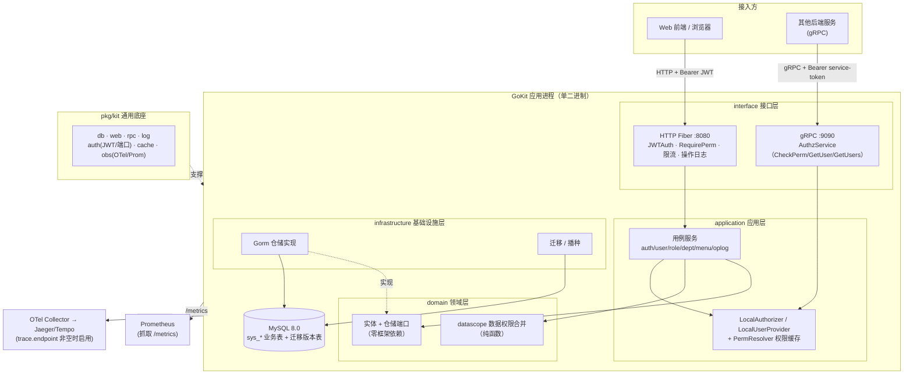
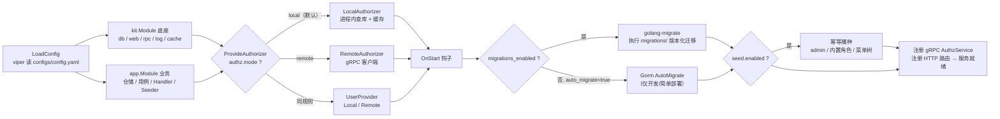
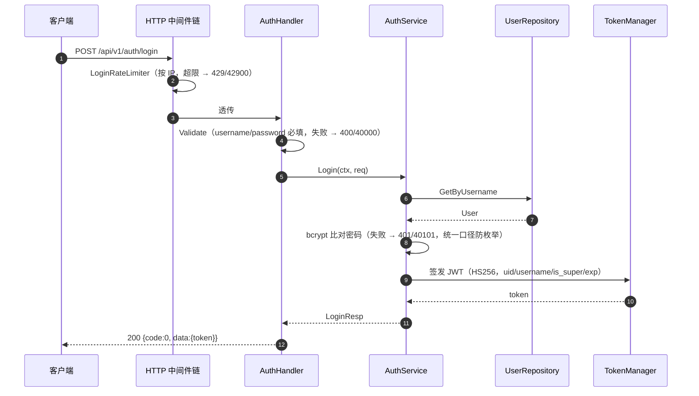
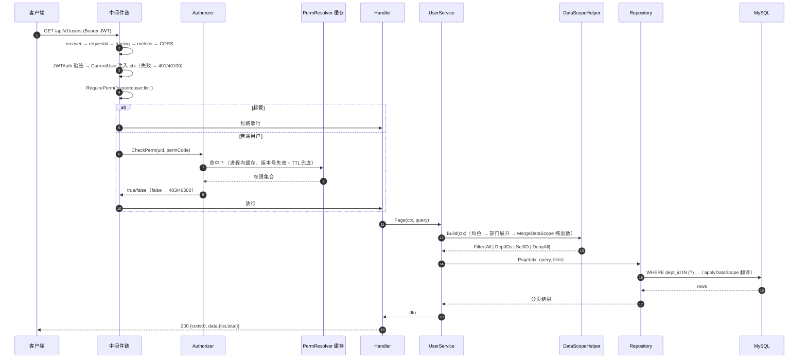
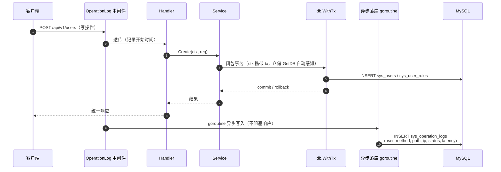
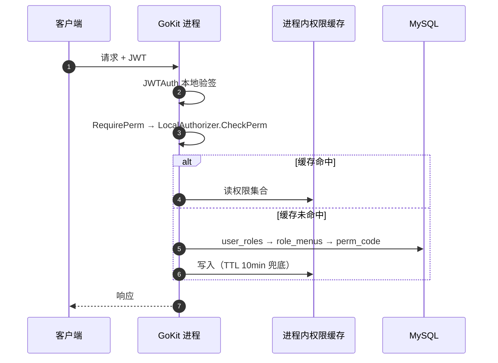
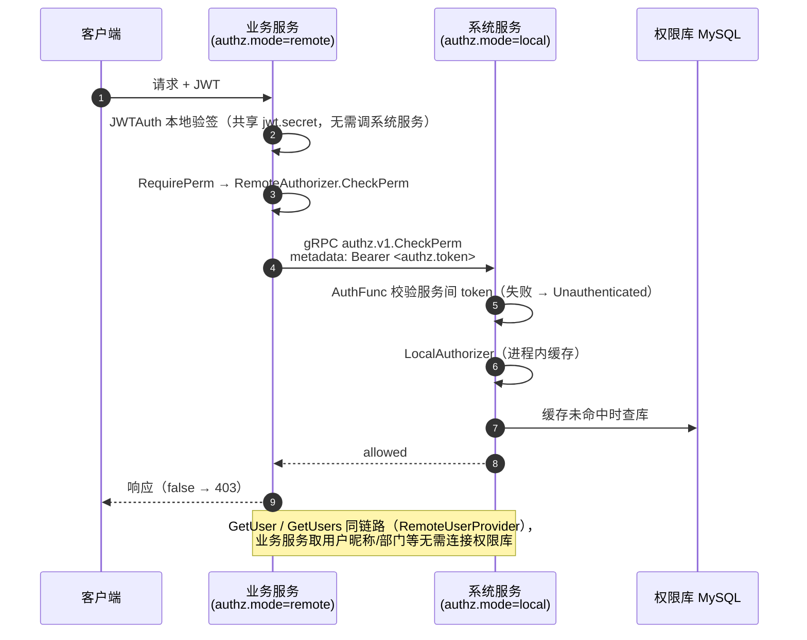
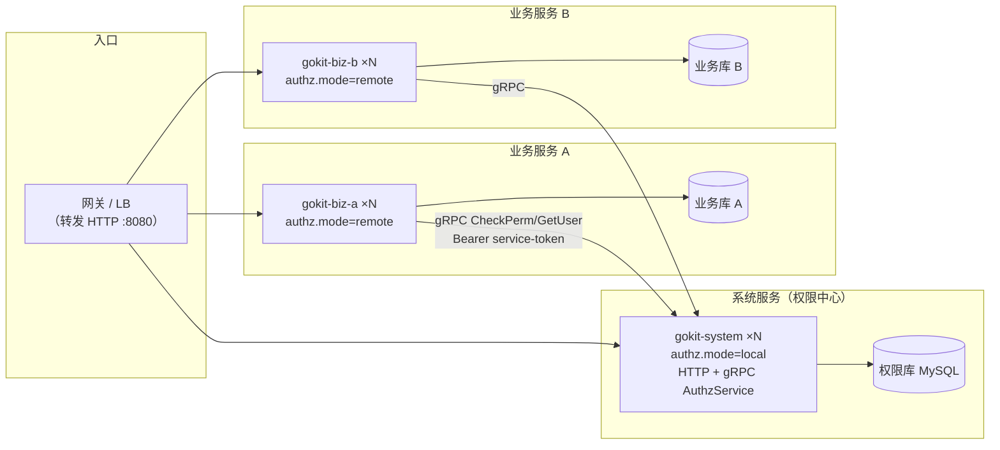

# GoKit 运行架构与部署文档

> 版本：v1.0 ｜ 配套文档：[architecture.md](architecture.md)（分层设计 / RBAC 模型 / API）
>
> 本文聚焦三件事：**整体架构图**、**关键技术流转图**、**单机与微服务两种授权模式下的部署说明**。

---

## 1. 总体架构



要点：

- **单二进制、双端口**：`:8080` 对外 HTTP，`:9090` 对内 gRPC（授权服务），同一进程启动。
- **依赖方向**：`interface → application → domain ← infrastructure`，业务代码不感知部署形态。
- **可观测性三件套**：`/api/v1/health`（liveness）、`/api/v1/readyz`（readiness，探 DB）、`/metrics`（Prometheus）；链路追踪按 `trace.endpoint` 开关。

---

## 2. 技术实现流转图

### 2.1 应用启动流程（Fx 装配）



### 2.2 登录流程



### 2.3 受保护请求流程（以用户列表为例）



### 2.4 写操作与操作日志



---

## 3. 授权双模式流转

模式由 `authz.mode` 决定，**业务代码零改动**——切换的只是 `Authorizer` / `UserProvider` 两个端口的实现。

### 3.1 单机模式（local，默认）



特点：权限校验零网络开销；角色/菜单/分配变更通过 `BumpVersion()` 即时失效缓存。适合单实例或少数实例、权限库与业务同库的场景。

### 3.2 微服务模式（remote）



安全前提：

- `authz.token` **生产必填**（共享密钥），系统服务 gRPC 拒裸奔调用；留空仅限内网可信环境。
- 跨不可信网络时应叠加 TLS/mTLS（当前 `RequireTransportSecurity=false`，面向内网明文 gRPC）。
- 所有服务共享同一 `jwt.secret`，验签不出进程，鉴权（授权）才走 RPC——权限数据集中管理，认证保持无状态。

### 3.3 模式对比

| 维度 | local（单机） | remote（微服务） |
| :--- | :--- | :--- |
| 权限校验路径 | 进程内（缓存 → 本地库） | gRPC → 系统服务（其进程内缓存） |
| 用户信息获取 | 进程内查库 | gRPC `GetUser/GetUsers` |
| 业务服务依赖 | 需连接权限库 | 仅需 gRPC 地址 + token，不连权限库 |
| 部署复杂度 | 单进程单库 | 多服务 + 服务发现/配置管理 |
| 适用场景 | 单体、中小系统、快速交付 | 多业务线共享统一权限中心 |

---

## 4. 单机部署

### 4.1 Docker Compose（推荐，一键）

```bash
cp configs/config.yaml.example configs/config.yaml
# 编辑 config.yaml：
#   database.dsn → root:root@tcp(mysql:3306)/gokit_db?charset=utf8mb4&parseTime=True&loc=Local
#   jwt.secret   → 强随机值
docker compose up -d --build
```

Compose 拓扑：MySQL 8.0（健康检查就绪后）→ app（暴露 8080/9090，只读挂载配置）。首次启动自动迁移 + 播种，默认账号 `admin / Admin@123`（首登后立即修改）。

### 4.2 二进制部署

```bash
go build -o server cmd/server/main.go
# 目录约定：二进制同级需有 configs/config.yaml（viper 从 ./configs 读取）
./server
```

systemd 单元示例：

```ini
[Unit]
Description=GoKit Server
After=network.target mysql.service

[Service]
WorkingDirectory=/opt/gokit
ExecStart=/opt/gokit/server
Restart=always
RestartSec=3
LimitNOFILE=65535

[Install]
WantedBy=multi-user.target
```

### 4.3 迁移策略选择

| 场景 | 配置 | 行为 |
| :--- | :--- | :--- |
| 开发/演示 | `auto_migrate: true` | Gorm 同步表结构，快速迭代 |
| 生产 | `migrations_enabled: true`，`auto_migrate: false` | 执行 `migrations/` 版本化迁移（000001 七表 + 000002 操作日志表），可审计可回滚 |

两者同开时版本化迁移优先并输出警告日志。升级版本时只需替换二进制/镜像，启动钩子自动执行新增迁移。

### 4.4 部署后验证

```bash
curl -sf localhost:8080/api/v1/health          # liveness
curl -sf localhost:8080/api/v1/readyz          # readiness（探 DB 连通性）
curl -s localhost:8080/metrics | head          # Prometheus 指标
TOKEN=$(curl -s -X POST localhost:8080/api/v1/auth/login \
  -H 'Content-Type: application/json' \
  -d '{"username":"admin","password":"Admin@123"}' | jq -r .data.token)
curl -s localhost:8080/api/v1/users -H "Authorization: Bearer $TOKEN"
```

---

## 5. 微服务部署

### 5.1 拓扑



### 5.2 拆分方法（从本仓库出发）

当前仓库**本身就是系统服务**：system 业务（用户/角色/部门/菜单/日志）+ gRPC AuthzService 已内置。新增业务服务的路径：

1. 以 `internal/domain`、`internal/application` 的业务包边界为单元新建模块（如 `order`），仓储用例照常开发。
2. 新服务有独立 `cmd/*/main.go`，依赖 `pkg/kit` 底座，**不 import** system 模块内部。
3. 需要用户信息/权限校验时注入 `auth.UserProvider` / `auth.Authorizer` 端口，`authz.mode=remote` 下自动走 gRPC。
4. 契约变更改 `api/proto/authz/v1/authz.proto`，双方 `make proto` 重新生成。

### 5.3 各服务配置样例

系统服务（权限中心）：

```yaml
authz:
  mode: "local"                 # 本服务自己查库做授权
  token: "<强随机共享密钥>"      # 必填：保护 gRPC AuthzService
jwt:
  secret: "<全集群共享>"         # 所有服务同一 secret
database:
  dsn: "...权限库..."
  migrations_enabled: true
trace:
  endpoint: "otel-collector:4317"
```

业务服务：

```yaml
authz:
  mode: "remote"
  addr: "gokit-system:9090"     # 系统服务 gRPC 地址（K8s Service 名 / 服务发现）
  token: "<与系统服务一致>"
jwt:
  secret: "<全集群共享>"         # 本地验签，不依赖系统服务可用性
database:
  dsn: "...自己的业务库..."     # 不连权限库
```

### 5.4 Kubernetes 部署要点

```yaml
# 系统服务 Deployment 片段（业务服务同构，改镜像与配置）
spec:
  containers:
    - name: gokit-system
      image: registry.example.com/gokit:1.0.0
      ports: [{containerPort: 8080}, {containerPort: 9090}]
      volumeMounts:
        - name: config
          mountPath: /app/configs
      livenessProbe:
        httpGet: {path: /api/v1/health, port: 8080}
      readinessProbe:
        httpGet: {path: /api/v1/readyz, port: 8080}   # DB 不通则摘流量
      resources:
        requests: {cpu: 100m, memory: 128Mi}
        limits:   {cpu: "1", memory: 512Mi}
  volumes:
    - name: config
      configMap: {name: gokit-config}   # jwt.secret / authz.token 建议改放 Secret
---
# 供业务服务调用 gRPC 的 ClusterIP Service
apiVersion: v1
kind: Service
metadata: {name: gokit-system}
spec:
  selector: {app: gokit-system}
  ports:
    - {name: http, port: 8080}
    - {name: grpc, port: 9090}
```

注意事项：

- **多实例**：权限缓存是进程内的，但失效靠版本号 + TTL 兜底，多副本间最坏 TTL（10min）收敛；对一致性敏感可把 TTL 调短或按扩展点换 Redis 缓存。登录限流同理为进程内计数，多副本需换 Redis Storage。
- **配置敏感项**：`jwt.secret`、`authz.token`、数据库 DSN 放 K8s Secret，而非 ConfigMap。
- **优雅退出**：Fx Lifecycle 已接管 HTTP/gRPC 关闭，`terminationGracePeriodSeconds` 保持默认 30s 即可。

### 5.5 可观测性接入

| 能力 | 接入 |
| :--- | :--- |
| 指标 | Prometheus 抓取各 Pod `:8080/metrics`（HTTP/gRPC 计数 + 耗时直方图，路径为路由模板防基数爆炸） |
| 链路 | 各服务 `trace.endpoint` 指向集群内 OTel Collector，再由 Collector 导出 Jaeger/Tempo；HTTP（otelfiber）与 gRPC（otelgrpc）自动埋点，跨服务 TraceID 串联 |
| 日志 | stdout JSON（slog），由采集 Agent 汇聚；日志内已注入 TraceID 可与链路关联 |
| 探针 | liveness=`/api/v1/health`，readiness=`/api/v1/readyz` |

---

## 6. 生产检查清单

- [ ] `jwt.secret` 已改为强随机值（单机）/ 全集群共享同一值（微服务）
- [ ] 微服务模式 `authz.token` 非空且各服务一致；跨不可信网络叠加 TLS/mTLS
- [ ] `database.migrations_enabled: true`、`auto_migrate: false`（生产）
- [ ] admin 默认密码已修改；`seed.enabled` 按需关闭
- [ ] `database.dsn` 指向生产库，连接池（`max_open_conns`）按库规格调整
- [ ] 探针、资源限额、副本数已配置；`/metrics` 已纳入 Prometheus
- [ ] 9090 端口不对公网暴露（仅集群内/内网可达）
- [ ] 升级流程验证：新版本镜像启动自动执行增量迁移，旧版本可回滚（迁移有 down 脚本）

## 7. 常见故障排查

| 现象 | 可能原因 | 处理 |
| :--- | :--- | :--- |
| 启动即退出 | `configs/config.yaml` 缺失或 DSN 不通 | 二进制同级需有 `configs/`；看启动日志 `migrations_start` 前后报错 |
| readyz 不通过 | DB 连接失败 | 检查 DSN、网络策略、`max_open_conns` |
| 业务服务全部 403 | `authz.token` 不一致 / 系统服务不可达 | 比对 token；`grpcurl` 直连系统服务 9090 验证 |
| 登录即 429 | 触发登录限流（默认 10 次/分钟/IP） | 调整 `rate_limit.login_max/login_window`；NAT 出口注意共享计数 |
| 权限变更不生效 | 进程内缓存 TTL 未到期（最坏 10min） | 正常设计（版本号失效为主）；远程模式检查系统服务侧缓存 |
| gRPC Unauthenticated | 调用方未带 service token | 确认业务服务 `authz.token` 非空且与系统服务一致 |
