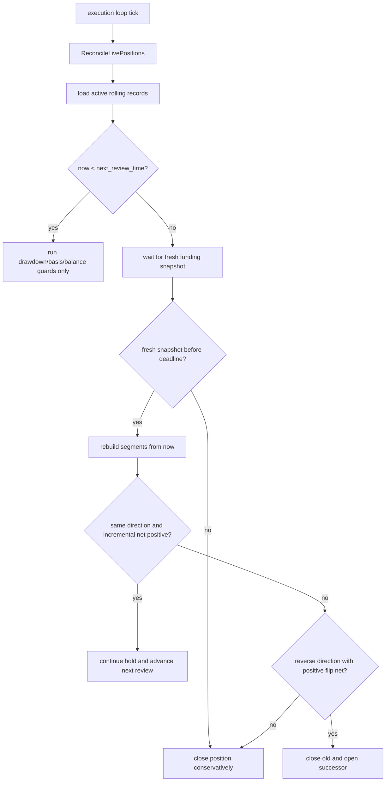

# Rolling Cycle Aligned Funding Arbitrage Design

## 1. 背景与目标

当前仓库的 funding 机会计算主链，以“在 `hold_hours` 内枚举候选结算点，再按固定方向累计两腿 carry”的方式工作。这个模型在下面的场景会失真：

- 一边 `1h` 结算，一边 `4h` / `8h` 结算；
- 两边 funding 方向相同，但最近一轮并不同步；
- 开仓后需要在下一结算点重新审视“是否继续持有、是否翻仓”，而不是从开仓时一次性固定到远端 target close。

本设计文档把策略重构目标明确为：

1. 收益计算从“候选点累计模型”升级为“结算分段模型”；
2. 开单决策从“固定方向 + 单一 target close”升级为“分段路径 + review 驱动续持”；
3. 持仓后新增持续监控状态机，在每个 review 点做 `continue / close / flip` 决策；
4. 配置层重构为“分层设计配置 + 当前运行时兼容桥”。

---

## 2. 当前实现的关键限制

当前代码的关键路径如下：

- `strategy_runner.go`
  - `projectFundingCarryVariants()`
  - `evaluateDirectionCandidate()`
  - `selectBestOpportunityProjection()`
- `planning.go`
  - `TargetCloseTimeMs` 固定为主窗口兑现时点
- `execution_service.go`
  - `openPlan()` / `closePlan()`
- `execution_auto_close.go`
  - 自动平仓以固定 `TargetCloseTimeMs` 为主
- `execution_risk_guards.go`
  - 开仓前 revalidation 复用当前累计投影逻辑

这条链路的问题是：

1. 它默认可以把“不同时点发生的 funding”直接累计后净掉；
2. 它只能表达一个 plan 的单方向收益，无法表达“到下一个 review 点重新决策”；
3. 它的执行层状态机属于订单执行状态机，不是策略持仓状态机。

---

## 3. 核心定义

### 3.1 Boundary

- `early venue`: 当前最近结算时间更早的一侧
- `late venue`: 当前最近结算时间更晚的一侧
- `sync boundary`: 两侧当前 `nextFundingTime` 中较晚的那个时点

示例：

- 当前时间 `13:48`
- Aster 下一次结算 `14:00`，周期 `1h`
- Binance 下一次结算 `16:00`，周期 `4h`
- 则：
  - `early venue = Aster`
  - `late venue = Binance`
  - `sync boundary = 16:00`

### 3.2 Segment

统一把从“现在”到 `sync boundary` 之前/之内的 funding 机会拆成若干 segment：

1. `single_real_segment`
   - 只有 early venue 发生 funding
   - funding 已是真实快照
   - 例：`14:00`

2. `single_forecast_segment`
   - 只有 early venue 发生 funding
   - 但该 funding 属于 boundary 之前的后续轮次，只允许用 early venue 的预测值
   - 例：`15:00`

3. `shared_real_segment`
   - 两边同一时刻 funding
   - 必须使用双方真实 next funding 快照
   - 例：`16:00`

### 3.3 Entry Path

`EntryPath` 定义为：

- 从当前时刻开始，
- 只保留“方向连续一致”的 segment 前缀，
- 用该前缀累计收益，得到首次开仓的主决策路径。

这意味着：

- `14:00` 和 `15:00` 如果方向一致，可以作为同一条 entry path；
- `16:00` 如果 shared segment 方向切换，则不再属于这条 entry path，而成为下一次 review 的决策点。

---

## 4. 收益规则

### 4.1 Single Segment

当最近结算不同步时，只按先结算那一侧计算收益。

```text
carry_rate = abs(rate_early)
```

方向规则：

```text
if rate_early < 0:
  long early venue / short other venue

if rate_early > 0:
  short early venue / long other venue
```

含义：

- funding 为负，做多该所吃 funding；
- funding 为正，做空该所吃 funding。

### 4.2 Shared Segment

当双方结算同一时点时，使用真实 funding 差。

```text
carry_rate = abs(rate_a - rate_b)
```

方向规则：

```text
lower funding rate venue => long
higher funding rate venue => short
```

### 4.3 预测护栏

预测只允许用于 `single_forecast_segment`，并遵守：

1. 只允许预测 early venue；
2. 只允许预测 `segment_time < sync_boundary`；
3. 一旦 `segment_time == sync_boundary`，必须双方都是真实 funding；
4. 禁止使用 early venue 的预测值跨过 boundary 与 late venue 的真实值做差。

---

## 5. 开单决策模型

### 5.1 首次开仓收益口径

首次开仓使用 `EntryPathNetPNL`：

```text
entry_path_net =
  entry_path_funding
  - open_fee
  - reserved_final_close_fee
  - slippage
  - safety_buffer
```

这里的关键点：

- 首次开仓时，必须预留最终平仓成本；
- 但不应该把未来“可能翻仓”的额外 close+open 成本提前算进 entry path；
- `EntryPath` 只负责回答“现在是否值得先打开这组仓位”。

### 5.2 示例

已知：

- 当前时间 `13:48`
- notional `1600`
- Aster `-0.356%`
- Binance `-1.2%`

分段如下：

1. `14:00`
   - `single_real_segment`
   - carry = `1600 * 0.356% = 5.696`
   - direction = `long Aster / short Binance`

2. `15:00`
   - `single_forecast_segment`
   - 若预测 Aster 仍为负，且方向与 `14:00` 一致，则可累加到 entry path

3. `16:00`
   - `shared_real_segment`
   - carry = `1600 * abs(-1.2% - (-0.356%)) = 13.504`
   - direction = `long Binance / short Aster`
   - 与前缀方向不同，不属于首次 entry path

因此：

- `14:00` 与 `15:00` 属于同一条 entry path；
- `16:00` 是下一次 review 的候选翻仓点。

---

## 6. 持仓后持续监控模型

### 6.1 设计原则

持仓后监控不再依赖“固定 target close”，而改为：

1. 仓位到达 `NextReviewTimeMs` 之前，只执行安全护栏；
2. 到达 review 点后，等待对应 funding fresh snapshot；
3. 基于“从现在开始”的新分段路径，重新做一次策略决策；
4. 决策结果只能是：
   - `continue`
   - `close`
   - `flip`

### 6.2 Review 决策口径

#### continue

方向与当前仓位一致时，使用增量收益：

```text
continue_net =
  incremental_funding
  - incremental_risk_buffer
```

这里不再重复扣：

- 首次 open fee
- 已经发生的 slippage

#### close

满足任一条件则平仓：

- 新路径无正向收益；
- funding snapshot 超时未刷新；
- shared segment 到来但真实差已消失；
- safety guard 触发；
- 同方向续持的增量收益低于门槛。

#### flip

shared segment 到来且新方向与当前仓位相反时，计算：

```text
flip_net =
  reverse_path_funding
  - close_old_fee
  - open_new_fee
  - reserved_new_final_close_fee
  - extra_slippage
  - flip_buffer
```

只有 `flip_net` 过门槛时才允许：

- 先平旧仓
- 再开 successor plan

否则直接平仓等待下一轮。

---

## 7. 持仓监控状态机

### 7.1 为什么不用 execution status 承载

当前 `execution_state_machine.go` 管的是：

- `pending_open`
- `opened`
- `pending_close`
- `closed`
- `open_partial_failed`
- `close_failed`

这属于订单执行状态机，不适合表达：

- 当前策略是 single segment 还是 shared segment；
- 下一次 review 点是何时；
- 是等待 funding snapshot，还是等待翻仓结果。

因此建议：

- 订单执行状态继续留在 `ExecutionRecord.Status`
- 策略监控状态下沉到 `ExecutionRecord.MonitorStateJSON`

### 7.2 Monitor State

建议最小状态结构：

```json
{
  "phase": "pre_sync_single_venue",
  "next_review_time_ms": 0,
  "current_sync_boundary_time_ms": 0,
  "current_direction_key": "long:aster|short:binance",
  "waiting_snapshot_exchange": "aster",
  "decision_deadline_ms": 0,
  "last_review_at_ms": 0,
  "review_reason": "funding_checkpoint"
}
```

### 7.3 Review Loop



---

## 8. 数据模型建议

### 8.1 Opportunity

建议新增：

- `StrategyMode`
- `RollingGroupKey`
- `EntryPathJSON`
- `SegmentDetailsJSON`
- `NextReviewTimeMs`
- `CurrentSyncBoundaryTimeMs`

### 8.2 ExecutionPlan

建议新增：

- `StrategyMode`
- `RollingGroupKey`
- `InitialReviewTimeMs`
- `InitialSyncBoundaryTimeMs`
- `EntryPathJSON`
- `PredecessorPlanKey`

### 8.3 ExecutionRecord

建议新增：

- `StrategyMode`
- `RollingGroupKey`
- `NextReviewTimeMs`
- `CurrentDirectionKey`
- `CurrentSyncBoundaryTimeMs`
- `MonitorStateJSON`
- `PredecessorPlanKey`
- `SuccessorPlanKey`

---

## 9. 模块拆分建议

建议新增模块：

### 9.1 `funding_segment_engine.go`

职责：

- 构建 `single_real_segment`
- 构建 `single_forecast_segment`
- 构建 `shared_real_segment`
- 输出 segment 列表与 `EntryPath`

建议核心函数：

```go
buildFundingSegments(now, longFunding, longForecast, shortFunding, shortForecast, cfg) []fundingSegment
buildEntryPath(segments []fundingSegment, cfg Config) fundingPath
evaluateRollingDecision(now, currentPosition, segments, cfg) rollingDecision
```

### 9.2 `rolling_monitor.go`

职责：

- 扫描 live rolling execution
- 到 review 点后等待 funding snapshot
- 驱动 `continue / close / flip`

建议核心函数：

```go
runRollingMonitor(ctx context.Context)
evaluateRollingRecord(ctx context.Context, now time.Time, rec entity.ExecutionRecord, plan *entity.ExecutionPlan) rollingMonitorDecision
```

### 9.3 `rolling_persistence.go`

职责：

- 序列化 `EntryPathJSON`
- 序列化 `MonitorStateJSON`
- successor / predecessor 链接

---

## 10. 代码落点

### 10.1 第 1 阶段

- 新增设计文档
- 新增配置层级与兼容归一化
- 不改策略执行主链

### 10.2 第 2 阶段

- 引入 `funding_segment_engine.go`
- 让机会计算页能看到 segment 明细和 entry path

### 10.3 第 3 阶段

- `planning.go` 生成 rolling plan
- `ExecutionPlan` 写入 `InitialReviewTimeMs`

### 10.4 第 4 阶段

- `ExecutionService.loop()` 新增 `runRollingMonitor()`
- 支持 `continue` 与 `close`

### 10.5 第 5 阶段

- 支持 `flip`
- 加入 predecessor / successor 链
- 加入 `RollingGroupKey` 去重，避免旧仓未平时同组重复开仓

---

## 11. 配置设计

新的配置层级建议如下：

```yaml
strategy:
  mode: "rolling_cycle_aligned"
  universe:
    allowed_symbols: ["BTC", "ETH"]
    core_symbols: ["BTC"]
    quote_asset: "USDT"
  capital:
    total_capital_usdt: 1000
    capital_utilization: 0.8
    leverage: 2
    assumed_notional: 1600
  opportunity:
    hold_hours: 24
    legacy_hold_selection_mode: "latest_profitable"
    min_net_pnl: 1.5
  execution_cost:
    slippage_bps: 2
    safety_buffer_usdt: 0.2
    entry_mode: "taker"
    exit_mode: "taker"
  market_data:
    max_data_age: 15s
    funding_snapshot_persist_interval: 60s
    book_snapshot_persist_interval: 20s
    snapshot_retention: 168h
    opportunity_calc_interval: 5s
  spread_guard:
    max_spread_bps: 12
    dynamic_max_spread_multiplier: 1.5
    dynamic_max_spread_reference_hours: 24
    entry_lead_time: 180s
    entry_cutoff_time: 45s
  prediction:
    funding_history_lookback: 6h
    funding_smoothing_current_weight: 0.7
    funding_rate_continuation_decay: 0.6
    allow_intermediate_forecast_before_boundary: true
    forbid_boundary_forecast: true
  rolling:
    entry_path_require_consistent_direction: true
    max_single_exchange_forecast_segments: 0
    review:
      settle_grace_period: 15s
      fresh_snapshot_max_wait: 20s
      close_on_snapshot_timeout: true
      continue_on_same_direction: true
      close_on_unprofitable: true
      require_incremental_net_positive: true
      min_incremental_net_pnl: 0
    flip:
      enabled: true
      require_net_positive: true
      min_net_pnl: 1.5
      slippage_multiplier: 1.5
      extra_safety_buffer_usdt: 0.2
```

### 11.1 兼容桥原则

由于当前主策略代码仍消费旧的平铺字段，所以配置层需要在 `Config.normalize()` 中：

1. 从新分层配置映射回旧平铺字段；
2. 保留旧字段兼容旧配置；
3. 为 rolling 设计生成一组运行时归一化字段；
4. 在 rolling 模式完全落地前，让旧执行主链仍有合理 fallback。

---

## 12. 测试计划

### 12.1 纯计算测试

- `1h vs 4h`，single real segment 只算 early venue
- `1h vs 4h`，boundary 前允许 early forecast
- shared segment 严禁 boundary forecast
- direction prefix 一旦改变，entry path 立即截断

### 12.2 监控测试

- 到 review 点前不动作
- 到 review 点但 funding snapshot 未刷新，等待
- 等待超时，保守平仓
- 同方向且增量净收益为正，继续持有
- 反向且 flip net 为正，close -> successor open
- 反向但 flip net 不够，直接平仓

### 12.3 执行安全测试

- successor plan 不得与 active predecessor 重复持仓
- close 成功但 successor open 失败，系统保持 flat
- 单腿异常时 recovery close 优先于 rolling decision

---

## 13. 推荐审阅顺序

1. 先看 `Section 3~6`，确认策略语义；
2. 再看 `Section 7~9`，确认工程拆分；
3. 最后看 `Section 11~12`，确认配置与测试边界。

这份文档对应当前分支的目标是：

- 先把设计和配置层定型；
- 再逐步把策略实现从 legacy projection 迁移到 rolling cycle aligned。

---

## 14. 当前实现状态

截至当前代码版本，已落地部分如下：

- 配置层：`strategy.mode=rolling_cycle_aligned`、rolling review/flip 配置、兼容旧平铺字段的 normalize 桥
- 机会计算：分段 funding engine、`single_real / single_forecast / shared_real`、entry path 截断、segment/entry path 明细持久化
- execution plan：持久化 `strategy_mode`、`rolling_group_key`、`next_review_time_ms`、`sync_boundary_time_ms`
- auto open：同一 rolling group 的 active 仓位去重，避免 predecessor/successor 双开
- 持仓监控：review 点等待快照、snapshot timeout close、same-direction continue、close-old/open-successor flip
- execution record：持久化 review 计数、下一次 review 锚点、predecessor/successor 关系

当前仍保留 legacy 行为的部分：

- legacy plan 的固定 `target_close_time` 自动平仓语义不变
- rolling successor 优先复用最新 plan batch；找不到时再即时构建 successor plan
- rolling monitor 目前使用 spot forecast 复核，不直接复用 StrategyRunner 的历史 funding forecaster 缓存
