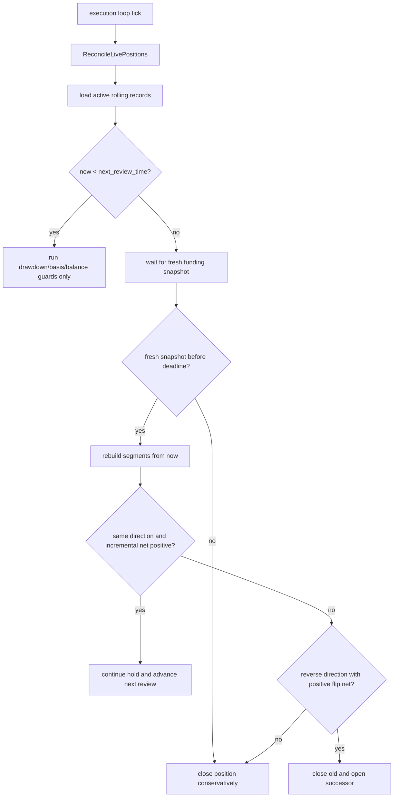
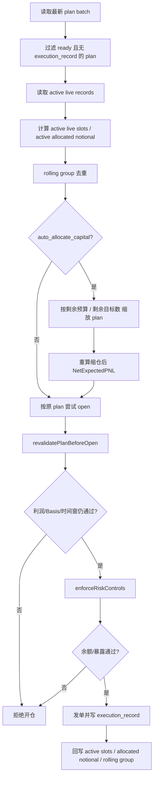
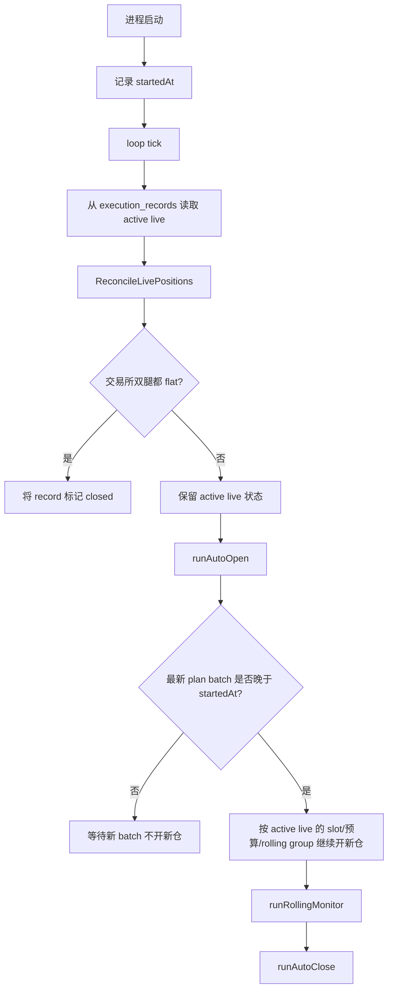

# Rolling Cycle Aligned Funding Arbitrage Design

## 1. 背景与目标

当前仓库的 funding 机会计算主链，以“在 `hold_hours` 内枚举候选结算点，再按固定方向累计两腿 carry”的方式工作。这个模型在下面的场景会失真：

- 一边 `1h` 结算，一边 `4h` / `8h` 结算；
- 两边 funding 方向相同，但最近一轮并不同步；
- 开仓后需要在下一结算点重新审视“是否继续持有、是否翻仓”，而不是从开仓时一次性固定到远端 target close。

本设计文档把策略重构目标明确为：

1. 收益计算从“候选点累计模型”升级为“结算分段模型”；
2. 开单决策从“固定方向 + 单一 target close”升级为“分段路径 + review 驱动续持”；
3. 持仓后新增持续监控状态机，在每个 review 点做 `continue / close / flip` 决策；
4. 配置层重构为“分层设计配置 + 当前运行时兼容桥”。

2026-03-30 更新：

- rolling 结构保留，但机会识别已从“real + forecast entry path”收紧为“real-only entry path”；
- 当前是否值得开仓，只看当前真实可结算的第一段；
- 未来段收益不再因为历史拟合被提前累计到 headline carry。

---

## 2. 当前实现的关键限制

当前代码的关键路径如下：

- `strategy_runner.go`
  - `projectFundingCarryVariants()`
  - `evaluateDirectionCandidate()`
  - `selectBestOpportunityProjection()`
- `planning.go`
  - `TargetCloseTimeMs` 固定为主窗口兑现时点
- `execution_service.go`
  - `openPlan()` / `closePlan()`
- `execution_auto_close.go`
  - 自动平仓以固定 `TargetCloseTimeMs` 为主
- `execution_risk_guards.go`
  - 开仓前 revalidation 复用当前累计投影逻辑

这条链路的问题是：

1. 它默认可以把“不同时点发生的 funding”直接累计后净掉；
2. 它只能表达一个 plan 的单方向收益，无法表达“到下一个 review 点重新决策”；
3. 它的执行层状态机属于订单执行状态机，不是策略持仓状态机。

---

## 3. 核心定义

### 3.1 Boundary

- `early venue`: 当前最近结算时间更早的一侧
- `late venue`: 当前最近结算时间更晚的一侧
- `sync boundary`: 两侧当前 `nextFundingTime` 中较晚的那个时点

示例：

- 当前时间 `13:48`
- Aster 下一次结算 `14:00`，周期 `1h`
- Binance 下一次结算 `16:00`，周期 `4h`
- 则：
  - `early venue = Aster`
  - `late venue = Binance`
  - `sync boundary = 16:00`

### 3.2 Segment

统一把从“现在”到 `sync boundary` 之前/之内的 funding 机会拆成若干 segment：

1. `single_real_segment`
   - 只有 early venue 发生 funding
   - funding 已是真实快照
   - 例：`14:00`

2. `shared_real_segment`
   - 两边同一时刻 funding
   - 必须使用双方真实 next funding 快照
   - 例：`16:00`

### 3.3 Entry Path

`EntryPath` 定义为：

- 从当前时刻开始，
- 只保留“当前真实可见”的 segment 前缀，
- 用该前缀累计收益，得到首次开仓的主决策路径。

这意味着：

- `14:00` 会成为当前 entry path；
- `15:00` 不再提前累计，而是等 `14:00` 之后拿到新快照，再作为下一次 review 的输入；
- `16:00` 如果 shared segment 方向切换，也是在后续 review 时重新判断。

---

## 4. 收益规则

### 4.1 Single Segment

当最近结算不同步时，只按先结算那一侧计算收益。

```text
carry_rate = abs(rate_early)
```

方向规则：

```text
if rate_early < 0:
  long early venue / short other venue

if rate_early > 0:
  short early venue / long other venue
```

含义：

- funding 为负，做多该所吃 funding；
- funding 为正，做空该所吃 funding。

### 4.2 Shared Segment

当双方结算同一时点时，使用真实 funding 差。

```text
carry_rate = abs(rate_a - rate_b)
```

方向规则：

```text
lower funding rate venue => long
higher funding rate venue => short
```

### 4.3 Real-Only 约束

当前 rolling 机会识别遵守下面的 real-only 约束：

1. 只用当前真实 `next funding` 快照生成机会；
2. 当前不同步时，只计算 early venue 的第一段真实 settlement；
3. 当前同步时，只计算这一档 shared real settlement；
4. 未来段不再通过历史均值、延续衰减或回归模型提前纳入当前开仓收益。

---

## 5. 开单决策模型

### 5.1 首次开仓收益口径

首次开仓使用 `EntryPathNetPNL`：

```text
entry_path_net =
  entry_path_funding
  - open_fee
  - reserved_final_close_fee
  - slippage
  - safety_buffer
```

这里的关键点：

- 首次开仓时，必须预留最终平仓成本；
- 但不应该把未来“可能翻仓”的额外 close+open 成本提前算进 entry path；
- `EntryPath` 只负责回答“现在是否值得先打开这组仓位”。

### 5.2 示例

已知：

- 当前时间 `13:48`
- notional `1600`
- Aster `-0.356%`
- Binance `-1.2%`

分段如下：

1. `14:00`
   - `single_real_segment`
   - carry = `1600 * 0.356% = 5.696`
   - direction = `long Aster / short Binance`

2. `15:00`
   - 不再提前计入当前 entry path
   - 需要等 `14:00` 过后，用新的真实快照重新判断

3. `16:00`
   - `shared_real_segment`
   - carry = `1600 * abs(-1.2% - (-0.356%)) = 13.504`
   - direction = `long Binance / short Aster`
   - 是否进入持仓路径，要等后续 review 再判断

因此：

- 当前 entry path 只包含 `14:00`；
- `15:00` 与 `16:00` 都属于后续 review 的候选时点。

---

## 6. 持仓后持续监控模型

### 6.1 设计原则

持仓后监控不再依赖“固定 target close”，而改为：

1. 仓位到达 `NextReviewTimeMs` 之前，只执行安全护栏；
2. 到达 review 点后，等待对应 funding fresh snapshot；
3. 基于“从现在开始”的新分段路径，重新做一次策略决策；
4. 决策结果只能是：
   - `continue`
   - `close`
   - `flip`

### 6.2 Review 决策口径

#### continue

方向与当前仓位一致时，使用增量收益：

```text
continue_net =
  incremental_funding
  - incremental_risk_buffer
```

这里不再重复扣：

- 首次 open fee
- 已经发生的 slippage

#### close

满足任一条件则平仓：

- 新路径无正向收益；
- funding snapshot 超时未刷新；
- shared segment 到来但真实差已消失；
- safety guard 触发；
- 同方向续持的增量收益低于门槛。

#### flip

shared segment 到来且新方向与当前仓位相反时，计算：

```text
flip_net =
  reverse_path_funding
  - close_old_fee
  - open_new_fee
  - reserved_new_final_close_fee
  - extra_slippage
  - flip_buffer
```

只有 `flip_net` 过门槛时才允许：

- 先平旧仓
- 再开 successor plan

否则直接平仓等待下一轮。

---

## 7. 持仓监控状态机

### 7.1 为什么不用 execution status 承载

当前 `execution_state_machine.go` 管的是：

- `pending_open`
- `opened`
- `pending_close`
- `closed`
- `open_partial_failed`
- `close_failed`

这属于订单执行状态机，不适合表达：

- 当前策略是 single segment 还是 shared segment；
- 下一次 review 点是何时；
- 是等待 funding snapshot，还是等待翻仓结果。

因此建议：

- 订单执行状态继续留在 `ExecutionRecord.Status`
- 策略监控状态下沉到 `ExecutionRecord.MonitorStateJSON`

### 7.2 Monitor State

建议最小状态结构：

```json
{
  "phase": "pre_sync_single_venue",
  "next_review_time_ms": 0,
  "current_sync_boundary_time_ms": 0,
  "current_direction_key": "long:aster|short:binance",
  "waiting_snapshot_exchange": "aster",
  "decision_deadline_ms": 0,
  "last_review_at_ms": 0,
  "review_reason": "funding_checkpoint"
}
```

### 7.3 Review Loop



---

## 8. 数据模型建议

### 8.1 Opportunity

建议新增：

- `StrategyMode`
- `RollingGroupKey`
- `EntryPathJSON`
- `SegmentDetailsJSON`
- `NextReviewTimeMs`
- `CurrentSyncBoundaryTimeMs`

### 8.2 ExecutionPlan

建议新增：

- `StrategyMode`
- `RollingGroupKey`
- `InitialReviewTimeMs`
- `InitialSyncBoundaryTimeMs`
- `EntryPathJSON`
- `PredecessorPlanKey`

### 8.3 ExecutionRecord

建议新增：

- `StrategyMode`
- `RollingGroupKey`
- `NextReviewTimeMs`
- `CurrentDirectionKey`
- `CurrentSyncBoundaryTimeMs`
- `MonitorStateJSON`
- `PredecessorPlanKey`
- `SuccessorPlanKey`

---

## 9. 模块拆分建议

建议新增模块：

### 9.1 `funding_segment_engine.go`

职责：

- 构建 `single_real_segment`
- 构建 `shared_real_segment`
- 输出 segment 列表与 `EntryPath`

建议核心函数：

```go
buildFundingSegments(now, longFunding, longForecast, shortFunding, shortForecast, cfg) []fundingSegment
buildEntryPath(segments []fundingSegment, cfg Config) fundingPath
evaluateRollingDecision(now, currentPosition, segments, cfg) rollingDecision
```

### 9.2 `rolling_monitor.go`

职责：

- 扫描 live rolling execution
- 到 review 点后等待 funding snapshot
- 驱动 `continue / close / flip`

建议核心函数：

```go
runRollingMonitor(ctx context.Context)
evaluateRollingRecord(ctx context.Context, now time.Time, rec entity.ExecutionRecord, plan *entity.ExecutionPlan) rollingMonitorDecision
```

### 9.3 `rolling_persistence.go`

职责：

- 序列化 `EntryPathJSON`
- 序列化 `MonitorStateJSON`
- successor / predecessor 链接

---

## 10. 代码落点

### 10.1 第 1 阶段

- 新增设计文档
- 新增配置层级与兼容归一化
- 不改策略执行主链

### 10.2 第 2 阶段

- 引入 `funding_segment_engine.go`
- 让机会计算页能看到 segment 明细和 entry path

### 10.3 第 3 阶段

- `planning.go` 生成 rolling plan
- `ExecutionPlan` 写入 `InitialReviewTimeMs`

### 10.4 第 4 阶段

- `ExecutionService.loop()` 新增 `runRollingMonitor()`
- 支持 `continue` 与 `close`

### 10.5 第 5 阶段

- 支持 `flip`
- 加入 predecessor / successor 链
- 加入 `RollingGroupKey` 去重，避免旧仓未平时同组重复开仓

---

## 11. 配置设计

新的配置层级建议如下：

```yaml
strategy:
  mode: "rolling_cycle_aligned"
  universe:
    allowed_symbols: ["BTC", "ETH"]
    core_symbols: ["BTC"]
    quote_asset: "USDT"
  capital:
    total_capital_usdt: 1000
    capital_utilization: 0.8
    leverage: 2
    assumed_notional: 1600
  opportunity:
    hold_hours: 24
    legacy_hold_selection_mode: "latest_profitable"
    min_net_pnl: 1.5
  execution_cost:
    slippage_bps: 2
    safety_buffer_usdt: 0.2
    entry_mode: "taker"
    exit_mode: "taker"
  market_data:
    max_data_age: 15s
    funding_snapshot_persist_interval: 60s
    book_snapshot_persist_interval: 20s
    snapshot_retention: 168h
    opportunity_calc_interval: 5s
  spread_guard:
    max_spread_bps: 12
    dynamic_max_spread_multiplier: 1.5
    dynamic_max_spread_reference_hours: 24
    entry_lead_time: 180s
    entry_cutoff_time: 45s
  prediction:
    funding_history_lookback: 6h
    funding_smoothing_current_weight: 0.7
    funding_rate_continuation_decay: 0.6
    allow_intermediate_forecast_before_boundary: true
    forbid_boundary_forecast: true
  rolling:
    entry_path_require_consistent_direction: true
    max_single_exchange_forecast_segments: 0
    review:
      settle_grace_period: 15s
      fresh_snapshot_max_wait: 20s
      close_on_snapshot_timeout: true
      continue_on_same_direction: true
      close_on_unprofitable: true
      require_incremental_net_positive: true
      min_incremental_net_pnl: 0
    flip:
      enabled: true
      require_net_positive: true
      min_net_pnl: 1.5
      slippage_multiplier: 1.5
      extra_safety_buffer_usdt: 0.2
```

### 11.1 兼容桥原则

由于当前主策略代码仍消费旧的平铺字段，所以配置层需要在 `Config.normalize()` 中：

1. 从新分层配置映射回旧平铺字段；
2. 保留旧字段兼容旧配置；
3. 为 rolling 设计生成一组运行时归一化字段；
4. 在 rolling 模式完全落地前，让旧执行主链仍有合理 fallback。

### 11.2 当前实现说明

- `prediction.*` 相关参数目前主要仍服务于 `legacy_projection`；
- `rolling_cycle_aligned` 的机会识别、开仓前复核和 review 决策，当前都已改成 real-only；
- `rolling.*` 里与 forecast 相关的字段暂时保留，是为了兼容旧配置和历史文档，不再直接抬高当前机会收益。

---

## 12. 测试计划

### 12.1 纯计算测试

- `1h vs 4h`，single real segment 只算 early venue
- `1h vs 4h`，boundary 前允许 early forecast
- shared segment 严禁 boundary forecast
- direction prefix 一旦改变，entry path 立即截断

### 12.2 监控测试

- 到 review 点前不动作
- 到 review 点但 funding snapshot 未刷新，等待
- 等待超时，保守平仓
- 同方向且增量净收益为正，继续持有
- 反向且 flip net 为正，close -> successor open
- 反向但 flip net 不够，直接平仓

### 12.3 执行安全测试

- successor plan 不得与 active predecessor 重复持仓
- close 成功但 successor open 失败，系统保持 flat
- 单腿异常时 recovery close 优先于 rolling decision

---

## 13. 推荐审阅顺序

1. 先看 `Section 3~6`，确认策略语义；
2. 再看 `Section 7~9`，确认工程拆分；
3. 最后看 `Section 11~12`，确认配置与测试边界。

这份文档对应当前分支的目标是：

- 先把设计和配置层定型；
- 再逐步把策略实现从 legacy projection 迁移到 rolling cycle aligned。

---

## 14. 当前实现状态

截至当前代码版本，已落地部分如下：

- 配置层：`strategy.mode=rolling_cycle_aligned`、rolling review/flip 配置、兼容旧平铺字段的 normalize 桥
- 机会计算：分段 funding engine、`single_real / single_forecast / shared_real`、entry path 截断、segment/entry path 明细持久化
- execution plan：持久化 `strategy_mode`、`rolling_group_key`、`next_review_time_ms`、`sync_boundary_time_ms`
- auto open：同一 rolling group 的 active 仓位去重，避免 predecessor/successor 双开
- 持仓监控：review 点等待快照、snapshot timeout close、same-direction continue、close-old/open-successor flip
- execution record：持久化 review 计数、下一次 review 锚点、predecessor/successor 关系

当前仍保留 legacy 行为的部分：

- legacy plan 的固定 `target_close_time` 自动平仓语义不变
- rolling successor 优先复用最新 plan batch；找不到时再即时构建 successor plan
- rolling monitor 目前使用 spot forecast 复核，不直接复用 StrategyRunner 的历史 funding forecaster 缓存

---

## 15. 多机会仓位分配与重启恢复

这一节描述的是“当前代码已经实现的行为”，不是理想化目标行为。

相关代码主入口：

- `planning.go`
- `execution_service.go`
- `execution_risk_guards.go`
- `execution_live_positions.go`
- `execution_rolling_monitor.go`

### 15.1 多个机会同时存在时，系统如何决定开哪些仓

当前实现分成两层：

1. 机会层
   - 所有 `eligible` 的机会都会先生成 `execution_plan`
   - 这一步不会因为“当前已经有别的仓位”而少生成 plan

2. 执行层
   - `ExecutionService.runAutoOpen()` 在每轮 loop 里只从最新 plan batch 里挑可以开的 plan
   - 真正决定“本轮到底开几条”的，是执行层的 slot / 预算 / rolling group / 风控

### 15.2 初始 plan 的默认仓位

`StrategyRunner.buildExecutionPlans()` 生成 plan 时，会先给每条 plan 写一套“默认目标仓位”：

- `CapitalAllocatedUSDT = total_capital_usdt * capital_utilization`
- `TargetNotionalUSDT = EffectiveNotional()`

这意味着：

- 计划层默认认为“每条机会都值得一套完整目标名义”
- 真正到自动开仓时，才会根据现有持仓和剩余预算做二次缩放

### 15.3 自动开仓时的候选过滤顺序

`runAutoOpen()` 当前的过滤顺序是：

1. 只看最新 plan batch
2. 只保留 `ReadyNow=true` 且 `status=ready`
3. 已经存在同 `plan_key` 的 `execution_record`，则跳过
4. rolling 模式下，若同一 `RollingGroupKey` 已有 active live record，则跳过
5. 若已达到 `max_live_plans`，停止继续开新仓
6. 若已达到 `max_auto_open_per_loop`，停止本轮继续开仓

### 15.4 rolling group 如何避免同组双持仓

`RollingGroupKey` 只编码：

- `symbol`
- 排序后的两个交易所名

它故意不编码方向。

因此：

- `Long A / Short B`
- `Long B / Short A`

属于同一个 rolling group。

这样执行层就能保证：

- 同一币种、同一交易所对，在同一时刻最多只保留一条 active rolling 仓位
- 到 review 点发生翻仓时，不会因为 successor plan 的 `plan_key` 不同而提前双开

### 15.5 多机会并发时的预算如何分配

如果 `execution.auto_allocate_capital=true`，自动开仓不会让第一条候选独占全部剩余预算。

当前逻辑：

1. 先统计当前 active live records 的已占用名义
2. `remainingBudget = EffectiveNotional() - activeAllocatedNotional`
3. 再估算“本轮剩余还可能开几条”
4. 用 `remainingBudget / remainingTargets` 作为每条候选的目标名义
5. 通过 `scalePlanForAutoBudget()` 把 plan 缩成较小仓位

这样做的结果是：

- 本轮里多个同时 ready 的机会，能尽量平均分到一份预算
- 预算不够时，后面的机会可能直接因为剩余预算耗尽而不再尝试

### 15.6 自动缩仓后，系统会不会重新复核利润

会。

而且是两次：

1. 缩仓时重算一遍计划收益
   - `scalePlanForAutoBudget()` 会按新的目标名义重新计算：
   - `FundingCarryPNL`
   - `EntryFeePNL`
   - `ExitFeePNL`
   - `SlippagePNL`
   - `SafetyBufferPNL`
   - `NetExpectedPNL`

2. 真正发单前再按当前市场快照做一次 revalidation
   - `openPlan()` 调用 `revalidatePlanBeforeOpen()`
   - 这里会重新读取当前 funding / book
   - 按当前缩仓后的 `plan.LongQty / ShortQty` 重新算当前名义
   - 再用当前 projection carry 计算：

```text
currentGrossFundingPNL = currentNotional * currentProjection.CarryRate
currentNetExpectedPNL =
  currentGrossFundingPNL
  - plan.EntryFeePNL
  - plan.ExitFeePNL
  - plan.SlippagePNL
  - plan.SafetyBufferPNL
```

最后它会再次校验：

```text
currentNetExpectedPNL >= cfg.MinNetPNL
```

所以，对你这个问题的明确答案是：

- 持续开仓时，如果因为已有仓位占用了预算，导致新机会只能缩小仓位
- 系统会按缩小后的仓位重新计算利润
- 如果缩小后利润跌破 `min_net_pnl`，这条单在发单前会被挡掉

### 15.7 这层复核的边界

当前实现虽然会复核利润，但它不是“重新回到机会层重新挑全局最优窗口”，而是：

- 尽量沿用这条 plan 当时已经选中的 funding 路径
- 用最新快照重算这条路径的当前 carry 和净收益

这意味着：

- 它回答的是“这条原计划现在还值不值得开”
- 不是“在预算变小后，市场上是否出现了另一条更值得开的机会”

### 15.8 开仓前还会过哪些风控

即使利润还够，真正发单前还要过 `enforceRiskControls()`：

- 交易所 adapter 是否可用
- 账户权益是否低于最低要求
- 可用余额是否足以覆盖保证金
- 单币总暴露是否超过 `max_single_symbol_exposure_usdt`
- 单交易所总暴露是否超过 `max_single_exchange_exposure_usdt`

所以多个机会并发时，一条机会最终能不能开，取决于：

- slot
- 剩余预算
- 缩仓后利润
- 账户余额
- 暴露上限

### 15.9 多机会自动开仓流程图



### 15.10 程序重启后，仓位是如何接管的

当前重启恢复不是靠内存，而是靠数据库中的 `execution_record`。

只要某条 live 仓位对应的 `execution_record` 还在，并且状态属于 active live 集合，它在重启后就会：

- 继续占用 live slot
- 继续占用 allocated notional 预算
- 继续参与 rolling review / auto close / live position reconcile

### 15.11 重启后的 loop 顺序

执行引擎每一轮 loop 的顺序是：

1. `ReconcileLivePositions()`
2. `runAutoOpen()`
3. `runRollingMonitor()`
4. `runAutoClose()`

这个顺序有两个直接后果：

1. 旧仓位会先参与对账，再决定是否还能继续被视作 active
2. auto-open 在同一轮里会先看到“数据库认为当前还活着的仓位”，因此不会把重启瞬间错误地当成空仓

### 15.12 重启后为什么不会立刻消费旧 plan

`runAutoOpen()` 在服务启动后的最初几轮，不会马上消费数据库里残留的旧 ready plan。

它会等到：

- 最新 plan batch 的 `AsOfTimeMs`
- 已经晚于这次进程的启动时间

才把 auto-open 解锁。

这样可以避免：

- 进程刚起来
- 新一轮机会和 plan 还没生成
- 却把重启前旧配置/旧模式留下的 ready plan 直接开掉

### 15.13 重启后，哪些 live 仓位会被继续视作“活跃”

当前 `ListActiveLive()` 把下面这些状态都视作 active live：

- `pending_open`
- `opened`
- `open_partial_failed`
- `open_hedging`
- `pending_close`
- `close_partial_failed`
- `close_failed`
- `close_hedging`

这意味着：

- 它们都会继续占用 live slot
- 也都会继续占用预算

### 15.14 重启后，系统会不会重新核对交易所真实仓位

会，但当前是“以数据库记录为起点”的对账，不是“先扫交易所全仓位再回填本地”。

具体行为：

1. 先从数据库拿 active live records
2. 对每条 record 去交易所查询 long/short 两腿当前仓位
3. 生成同步状态：
   - `in_sync`
   - `awaiting_fill`
   - `single_leg`
   - `flat`
   - `side_mismatch`
   - `error`

### 15.15 当前自动修复能力

当前自动 reconcile 只会自动处理一种明确情况：

- 数据库里还认为 live
- 但交易所两腿都已经 flat

这时系统会把 `execution_record` 自动推进到 `closed`。

下面这些情况当前只会被识别，不会自动“认领/修复”成完整新状态：

- 交易所上有单腿残仓
- 双腿方向不匹配
- 交易所上有真实仓位，但本地完全没有对应 `execution_record`

### 15.16 rolling 仓位在重启后如何继续监控

只要满足：

- `live_trading=true`
- `auto_close=true`
- `strategy_mode=rolling_cycle_aligned`
- `status=opened`

这条仓位在重启后仍会继续进入 `runRollingMonitor()`。

也就是说，`NextReviewTimeMs`、`CurrentSyncBoundaryMs`、`ReviewCount` 这类状态不是临时内存，而是可恢复的。

### 15.17 当前实现的一个重要注意事项

自动预算模式下，`scalePlanForAutoBudget()` 生成的是“本轮打开时使用的缩仓版 plan”。

当前实现里：

- 这份缩仓版 plan 会直接传给 `openPlan()` 用来发单
- `ExecutionRecord.AllocatedNotionalUSDT` 也会按缩仓后的值写入数据库

但它不会把缩仓后的整份 plan 再回写到 `execution_plans` 表。

因此当前代码的实际含义是：

- 预算统计以 `execution_record.allocated_notional_usdt` 为准，能够在重启后正确延续
- 但 `execution_plans` 里保留的仍是原始批次 plan 尺寸

这会带来一个当前已知的工程边界：

- “实际开出去的尺寸”
- 和“按 `plan_key` 重新查回来的 execution plan 尺寸”

在 auto-allocation 开启时，可能并不完全一致。

当前实现之所以还能工作，主要依赖：

- 预算统计优先读 `execution_record`
- 平仓走 reduce-only 语义时，即使计划数量偏大，也会尽量避免把仓位反向打穿

但从设计完整性上看，这仍然是一个后续值得收口的点。

### 15.18 重启恢复流程图


